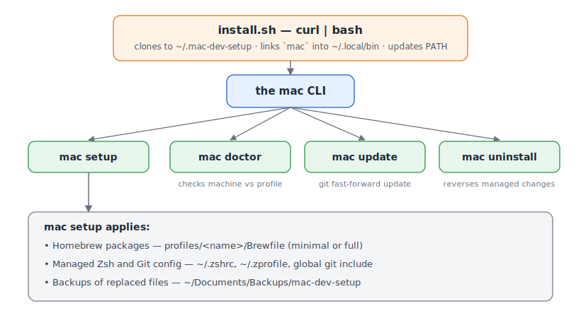
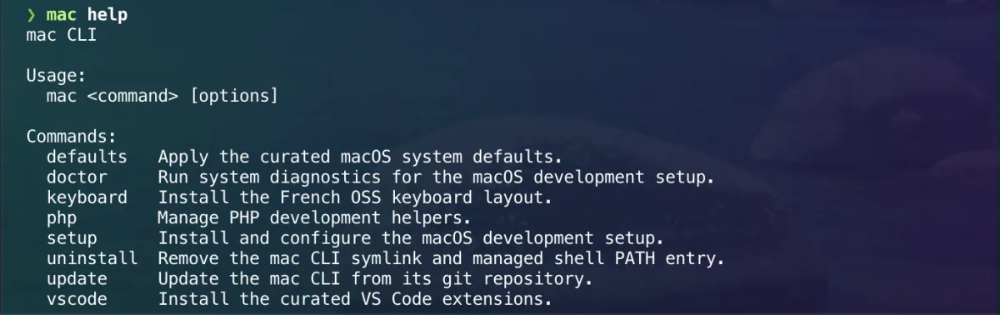
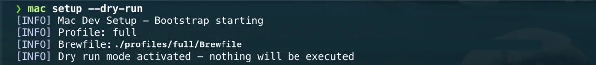
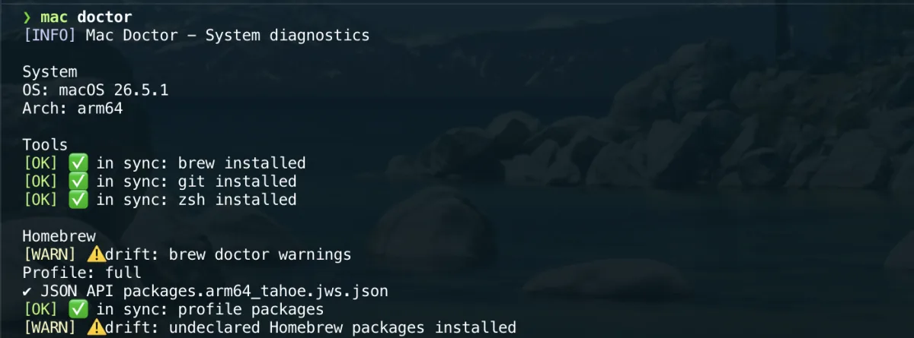
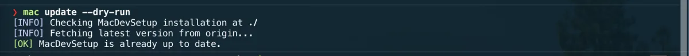
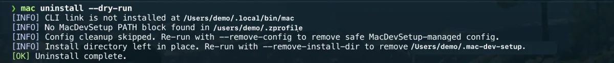

# MacDevSetup

[](https://github.com/Labault/mac-dev-setup/actions/workflows/ci.yml)
[](https://github.com/Labault/mac-dev-setup/actions/workflows/ci-macos.yml)
[](LICENSE)


Set up a new Mac for development with **one command**, then manage everything
through a small CLI called `mac`.

> **New here? Read this file once, top to bottom.** It explains what’s
> included, how to install it, and which commands you can run afterward.

## Who this is for

MacDevSetup is an **opinionated, personal** macOS setup, shared so anyone can
reuse or fork it. It fits you if you want a reproducible, one-command Mac setup
and are comfortable in the terminal.

There are two ways in:

- **Start lean** with `--profile minimal` — a neutral core of shell, Git, and
  command-line tools that suits almost everyone.
- **Take the full workstation** with `--profile full` — the maintainer's exact
  stack: a PHP/Symfony toolchain, quality linters, GUI apps, and a French
  keyboard layout. Great if your needs overlap; otherwise start minimal.

New here and unsure? Use `minimal` and add what you need. To make this your own
setup, see [Make it yours](#make-it-yours).

## How it works at a glance

`install.sh` sets up a small `mac` CLI. Its commands install your tools and keep
your machine in a known state — and everything is reversible.



## Quick start (30 seconds)

```bash
curl -fsSL https://raw.githubusercontent.com/labault/mac-dev-setup/main/install.sh | bash
# open a new terminal tab/window
mac setup --profile minimal   # lean core; omit --profile to install the full workstation
```

This is the fastest path. Keep reading for profiles, managed files, rollback,
and the full command reference.

## Table of contents

- [Who this is for](#who-this-is-for)
- [How it works at a glance](#how-it-works-at-a-glance)
- [Quick start (30 seconds)](#quick-start-30-seconds)
- [What's included](#whats-included)
- [Installation](#installation)
- [Make it yours](#make-it-yours)
- [The `mac` CLI — command reference](#the-mac-cli--command-reference)
- [Going further](#going-further)
- [License](#license)

---

## What's included

Each tool has a dedicated page covering installation, configuration, and
removal.

Two quick commands work for most tools listed here:

```bash
tldr <tool>        # short, example-first cheatsheet (works offline)
brew info <tool>   # description, version, and homepage
```

### Shell & command-line tools

These run in the terminal and improve on macOS built-ins.

| Tool | What it does | Documentation |
| --- | --- | --- |
| `antidote` | Zsh plugin manager | [docs/zsh/antidote.md](docs/zsh/antidote.md) |
| `autojump` | Jump to a frequent directory with `j <partial-name>` | [docs/cli/autojump.md](docs/cli/autojump.md) |
| `bat` | `cat` with syntax highlighting and Git annotations | [docs/cli/bat.md](docs/cli/bat.md) |
| `duf` | Disk space overview (friendlier `df`) | [docs/cli/duf.md](docs/cli/duf.md) |
| `dust` | Show what is taking up disk space (friendlier `du`) | [docs/cli/dust.md](docs/cli/dust.md) |
| `glances` | Real-time system monitor (CPU, memory, disk, network) | `tldr glances` |
| `lsd` | `ls` with colors, icons, and a tree view | [docs/cli/lsd.md](docs/cli/lsd.md) |
| `terminal-notifier` | Send macOS notifications from shell scripts | [docs/macos/terminal-notifier.md](docs/macos/terminal-notifier.md) |
| `tldr` | Short, example-first manual pages — installed as `tlrc` formula | `tldr tldr` |
| `tokei` | Count lines of code by language | [docs/cli/tokei.md](docs/cli/tokei.md) |
| `tree` | Show a directory as a tree | [docs/cli/tree.md](docs/cli/tree.md) |

---

### Git & security

| Tool | What it does | Documentation |
| --- | --- | --- |
| `gh` | GitHub from the terminal: open PRs, create issues, clone repos | `gh --help` |
| `git-delta` | Readable, colored Git diffs | [docs/git/git-delta.md](docs/git/git-delta.md) |
| `gitleaks` | Scan your repo for accidentally committed secrets | [docs/security/gitleaks.md](docs/security/gitleaks.md) |
| Gitmoji | Emoji + Conventional Commit convention (enforced by a commit-msg shell hook) | [docs/git/gitmoji.md](docs/git/gitmoji.md) |
| KeeWeb | KeePass-compatible password manager (desktop app) | [docs/security/keeweb.md](docs/security/keeweb.md) |

---

### PHP & Symfony development

These are only installed with the `full` profile.

| Tool | What it does | Documentation |
| --- | --- | --- |
| `composer` | PHP dependency manager | [docs/php/php.md](docs/php/php.md) |
| pcov | Fast PHP code coverage (project-level, replaces Xdebug for CI) | [docs/php/coverage.md](docs/php/coverage.md) |
| Pest | Modern PHP test framework | [docs/php/pest.md](docs/php/pest.md) |
| `php` | PHP runtime (Homebrew-managed, Apple Silicon native) | [docs/php/php.md](docs/php/php.md) |
| PHP-CS-Fixer / Rector | Autoformat and auto-refactor PHP code | [docs/php/coding-standards.md](docs/php/coding-standards.md) |
| PHPStan / Psalm | Static analysis — catch bugs before running the code | [docs/php/static-analysis.md](docs/php/static-analysis.md) |
| `symfony-cli` | Create, run, and manage Symfony projects | [docs/php/php.md](docs/php/php.md) |
| `xdebug` | Step debugger for PHP | [docs/php/xdebug.md](docs/php/xdebug.md) |

---

### Quality, CI & containers

Linting and quality tools run automatically before each commit via `pre-commit`.

| Tool | What it does | Documentation |
| --- | --- | --- |
| `act` | Run GitHub Actions locally (no push needed to test a workflow) | [docs/github-actions/act.md](docs/github-actions/act.md) |
| `actionlint` | Validate GitHub Actions workflow files | [docs/github-actions/actionlint.md](docs/github-actions/actionlint.md) |
| `ctop` | Live container resource monitor, `top`-style | [docs/docker/ctop.md](docs/docker/ctop.md) |
| `editorconfig-checker` | Enforce `.editorconfig` rules across the repo | [docs/quality/editorconfig-checker.md](docs/quality/editorconfig-checker.md) |
| `hadolint` | Lint Dockerfiles | [docs/docker/hadolint.md](docs/docker/hadolint.md) |
| `lychee` | Find broken links in documentation | [docs/quality/lychee.md](docs/quality/lychee.md) |
| `markdownlint-cli2` | Enforce consistent Markdown formatting | [docs/quality/markdownlint-cli2.md](docs/quality/markdownlint-cli2.md) |
| OrbStack | Fast, lightweight Docker Desktop replacement | [docs/docker/orbstack.md](docs/docker/orbstack.md) |
| `pre-commit` | Run quality checks automatically before every `git commit` | [docs/quality/pre-commit.md](docs/quality/pre-commit.md) |
| `shellcheck` | Find bugs and bad patterns in shell scripts | [docs/quality/shellcheck.md](docs/quality/shellcheck.md) |

---

### Editors & terminal

| App | What it does | Documentation |
| --- | --- | --- |
| Sublime Text | Lightweight editor for quick edits and large files | [docs/editors/sublime-text.md](docs/editors/sublime-text.md) |
| Visual Studio Code | Primary code editor | [docs/editors/vscode.md](docs/editors/vscode.md) |
| Warp | Modern terminal with AI autocompletion | [docs/warp/warp.md](docs/warp/warp.md) |

---

### Databases

| App | What it does | Documentation |
| --- | --- | --- |
| Beekeeper Studio | SQL editor with a clean interface (PostgreSQL, MySQL, SQLite) | [docs/database/beekeeper-studio.md](docs/database/beekeeper-studio.md) |

---

### Productivity & macOS

| App | What it does | Documentation |
| --- | --- | --- |
| CleanShot X | Screenshot and screen recording with annotation and OCR | [docs/productivity/cleanshot.md](docs/productivity/cleanshot.md) |
| GIMP | Open-source image editor for retouching and export | [docs/productivity/gimp.md](docs/productivity/gimp.md) |
| Ice | Menu bar manager — hide, organise, and reorder menu bar icons | [docs/macos/menu-bar.md#ice](docs/macos/menu-bar.md#ice) |
| Notion | Collaborative workspace for notes, databases, and project tracking | [docs/productivity/notion.md](docs/productivity/notion.md) |
| Obsidian | Local-first Markdown note-taking app | [docs/productivity/obsidian.md](docs/productivity/obsidian.md) |
| Pearcleaner | Cleanly uninstall apps and their leftover files | [docs/macos/pearcleaner.md](docs/macos/pearcleaner.md) |
| Raycast | Launcher that replaces Spotlight: clipboard history, snippets, window management | [docs/productivity/raycast.md](docs/productivity/raycast.md) |
| Stats | System monitor in the menu bar (CPU, memory, network) | [docs/macos/menu-bar.md#stats](docs/macos/menu-bar.md#stats) |
| SwiftBar | Turn any shell script into a menu bar item with auto-refresh | [docs/macos/menu-bar.md#swiftbar](docs/macos/menu-bar.md#swiftbar) |

---

### Web & API

| App | What it does | Documentation |
| --- | --- | --- |
| Bruno | Git-friendly API client — collections stored as plain files in your repo | [docs/web/bruno.md](docs/web/bruno.md) |
| Excalidraw | Hand-drawn-style diagrams in the browser or VS Code | [docs/web/excalidraw.md](docs/web/excalidraw.md) |
| Firefox | Secondary browser for cross-browser testing | [docs/web/firefox.md](docs/web/firefox.md) |
| Google Chrome | Primary development browser | [docs/web/chrome.md](docs/web/chrome.md) |
| RealFaviconGenerator | Generate favicons for all platforms from a single source image | [docs/web/favicons.md](docs/web/favicons.md) |
| remove.bg | Remove image backgrounds automatically | [docs/web/image-services.md](docs/web/image-services.md) |

---

### AI assistants

| Tool | What it does | Documentation |
| --- | --- | --- |
| Claude (desktop app + CLI) | AI assistant for reasoning, writing, design, and agentic coding | [docs/ai/claude.md](docs/ai/claude.md) |
| Codex (CLI) | OpenAI's coding assistant, installed globally via `npm` | [docs/ai/codex.md](docs/ai/codex.md) |
| CodexBar | Menu bar app tracking token usage and cost across AI providers | [docs/ai/codexbar.md](docs/ai/codexbar.md) |
| Ollama | Run large language models locally (Mistral, Llama, etc.) | [docs/ai/ollama.md](docs/ai/ollama.md) |

---

### Monitoring & error tracking

| Tool | What it does | Documentation |
| --- | --- | --- |
| Sentry | Error tracking and performance monitoring for Symfony projects | [docs/monitoring/sentry.md](docs/monitoring/sentry.md) |
| SwiftBar + custom scripts | Lightweight VPS and site uptime monitoring in the menu bar | [docs/macos/menu-bar.md#swiftbar](docs/macos/menu-bar.md#swiftbar) |

---

The complete package inventory (USED / INSTALLED / TOOLING) lives in
[docs/homebrew/inventory.md](docs/homebrew/inventory.md).

---

## Installation

### Prerequisites

Before starting, make sure you have:

- **macOS** (Apple Silicon or Intel)
- **Git** — comes pre-installed on macOS; check with `git --version`
- An **internet connection**
- Permission to install software (admin account)

You do **not** need to install Homebrew beforehand — the setup does it for you.
On a fresh Mac, macOS will prompt to install the **Command Line Tools** the
first time Homebrew runs; accept that prompt and let it finish.

---

### Step 1 — Run the installer

Open **Terminal** (or Warp, iTerm2, etc.) and run:

```bash
curl -fsSL https://raw.githubusercontent.com/labault/mac-dev-setup/main/install.sh | bash
```

This command:

- Downloads this repository to `~/.mac-dev-setup`.
- Creates a `mac` command available from anywhere in your terminal.
- Adds `~/.local/bin` to your shell `PATH`.

It does **not** install tools yet — that happens in Step 4.

Prefer to read the script before running it? Download and inspect it first:

```bash
curl -fsSL https://raw.githubusercontent.com/labault/mac-dev-setup/main/install.sh -o install.sh
less install.sh   # review what it does
bash install.sh
```

---

### Step 2 — Reload your shell

Close and reopen your terminal (or open a new tab), then confirm `mac` is
available:

```bash
mac help
```

You should see a list of commands. If `mac` is not found, open a new tab — your
shell likely hasn’t reloaded yet.



---

### Common first-run issues

- **`mac: command not found` after installation**
  Open a new terminal tab/window and run `mac help` again. If needed, reload
  your shell profile manually (`source ~/.zprofile`).
- **Homebrew install fails due to permissions**
  Complete any pending macOS/Xcode Command Line Tools prompts, then rerun `mac
  setup`.
- **Network/proxy blocks package downloads**
  Retry on a stable network or configure your proxy settings first, then run
  `mac setup --dry-run` to preview.

For deeper diagnostics, see
[docs/troubleshooting/troubleshooting.md](docs/troubleshooting/troubleshooting.md).

---

### Step 3 — Choose a profile

A **profile** decides which tools are installed. New here? Start with
`minimal` — you can always add the rest later.

| Profile | Best for | What you get |
| --- | --- | --- |
| `minimal` | Lightweight shell + Git workflow | Core CLI tools, Git helpers, `gh`, `node`, `pre-commit` (14 Homebrew packages) |
| `full` | The maintainer's complete workstation (the default) | Everything in `minimal` + PHP/Symfony stack, quality linters, GUI apps, containers, databases, AI tools (51 Brewfile entries: 29 formulae, 21 casks, 1 tap) |


The exact lists live in
[`profiles/minimal/Brewfile`](profiles/minimal/Brewfile) and
[`profiles/full/Brewfile`](profiles/full/Brewfile). To change what either
profile installs, see [Make it yours](#make-it-yours).

---

### Step 4 — Install the development environment

```bash
mac setup --profile minimal   # or: mac setup --profile full
```

Running `mac setup` without `--profile` installs the **full** profile.

This is the main step:

1. Installs **Homebrew** if it is not already on your machine.
2. Installs every package from your selected **profile**.
3. Configures **Git** through a managed global include.
4. Installs the **Zsh** configuration and shell completion for `mac`.

Expect a few minutes on first run while Homebrew downloads and builds packages.

`mac setup` is safe to rerun. It reapplies managed config and only updates
files when needed; user files are backed up before replacement when content
differs.

Want to preview what it *would* do without changing anything?

```bash
mac setup --dry-run
```



---

### Step 5 — Apply optional settings (when you're ready)

These commands change system or app settings. They are **not** run
automatically:

```bash
mac defaults                 # apply curated macOS Finder / Dock / keyboard tweaks
mac keyboard                 # install the Français OSS Mac keyboard layout (French typists only)
mac vscode                   # install the curated VS Code extensions
mac vscode --with-optional   # also install the optional extension set
```

---

### Files MacDevSetup manages

To configure shell and Git, MacDevSetup may create or update these user-level
files:

- `~/.zprofile`, `~/.zshrc`, `~/.zsh_plugins.txt`, `~/.p10k.zsh`
- `~/.shell/alias.sh`
- `~/.zsh/completions/_mac`
- a global Git `include.path`

Existing files are **backed up before replacement** when they differ from the
versioned ones. Backups go to `~/Documents/Backups/mac-dev-setup/zsh`.


---

### Undo / rollback summary

- **Undo managed CLI/config changes:** `mac uninstall --dry-run` then
  `mac uninstall` (add `--remove-config` only if you want managed config files
  removed when they are unchanged from the versioned copies).
- **Restore your previous shell files:** use the backup copies in
  `~/Documents/Backups/mac-dev-setup/zsh`.
- **Remove the local repository clone:** `mac uninstall --remove-install-dir`.
- **Keep installed tools/apps:** uninstalling MacDevSetup does not remove
  Homebrew packages or installed applications.

---

## Make it yours

The `full` profile reflects one developer's choices. Forking and adapting it is
expected — here is where to change things:

- **Add or remove tools:** edit [`profiles/minimal/Brewfile`](profiles/minimal/Brewfile)
  and [`profiles/full/Brewfile`](profiles/full/Brewfile). Each line is a Homebrew
  `brew`/`cask`/`tap` entry; `mac doctor` reports anything installed but not
  declared.
- **Create your own profile:** add `profiles/<name>/Brewfile`, then
  `mac setup --profile <name>`. Profiles are discovered from the directory, so no
  code change is needed.
- **Keep machine-specific or private shell config out of the repo:** put it in
  `~/.shell/local.zsh`, which the managed `.zshrc` sources automatically and which
  is never overwritten. See [docs/zsh/zsh.md](docs/zsh/zsh.md).
- **Skip the parts you don't need:** the keyboard layout, macOS defaults, and VS
  Code extensions are all opt-in commands (`mac keyboard`, `mac defaults`,
  `mac vscode`) — simply don't run them.
- **Point the installer at your own fork:** set `MAC_DEV_SETUP_REPO_URL` before
  running `install.sh` to clone from your repository instead.

---

## The `mac` CLI — command reference

Every command supports `--help`:

```bash
mac <command> --help
```

### All commands

| Command | What it does |
| --- | --- |
| `mac help` | List all available commands |
| `mac setup` | Install or reapply the full development environment |
| `mac doctor` | Check your machine against the selected profile — reports what is missing, out of date, or drifted |
| `mac php` | Manage PHP development helpers (Xdebug on/off) |
| `mac update` | Update MacDevSetup itself to the latest version |
| `mac uninstall` | Remove the `mac` CLI and its managed configuration |
| `mac defaults` | Apply curated macOS Finder / Dock / keyboard defaults *(opt-in)* |
| `mac keyboard` | Install the Français OSS Mac keyboard layout *(opt-in)* |
| `mac vscode` | Install the curated VS Code extensions *(opt-in)* |

---

### `mac setup`

Installs and configures the development environment.

```bash
mac setup                       # install everything (full profile)
mac setup --profile minimal     # install the minimal profile only
mac setup --dry-run             # preview what would happen, change nothing
```

---

### `mac doctor`

Checks your machine against the expected state. Useful after switching
machines, pulling updates, or debugging.

```bash
mac doctor                      # check your machine (uses your current profile)
mac doctor --profile minimal    # check against the minimal profile specifically
mac doctor --fix                # print the commands that would fix each issue (does not run them)
mac doctor --summary            # collapse long lists to a count (handy when many tools drift)
```

`mac doctor` reports three things:

- **Missing** — a tool declared in the profile is not installed.
- **Drift** — a managed config file differs from the versioned copy.
- **Undeclared** — a tool is installed but not declared in any profile.



---

### `mac php`

Manages PHP-specific helpers without touching Homebrew directly.

```bash
mac php xdebug status    # show whether Xdebug is enabled or disabled
mac php xdebug enable    # enable Xdebug (for local debugging)
mac php xdebug disable   # disable Xdebug (for performance / CI)
```

Xdebug is kept **disabled by default** — it adds overhead to every request.
Enable it only when you are actively debugging.

---

### `mac update`

Pulls the latest version of MacDevSetup from GitHub and fast-forwards your
local copy.

```bash
mac update              # update to the latest version
mac update --dry-run    # preview the update, change nothing
```



If you have uncommitted changes, `mac update` refuses to proceed to avoid
overwriting your work.

---

### `mac uninstall`

Removes MacDevSetup from your machine. Installed tools (Homebrew packages and
apps) are **not** removed — only the `mac` CLI and its managed entries.

```bash
mac uninstall                       # remove the CLI + managed PATH entry
mac uninstall --remove-config       # also remove managed config files (only if identical to the versioned copies)
mac uninstall --remove-install-dir  # also remove ~/.mac-dev-setup
mac uninstall --dry-run             # preview what would be removed, change nothing
```



---

## Going further

Full documentation lives in [`docs/`](docs/README.md) — start at the
[documentation index](docs/README.md) for the complete, browsable map. Good
entry points:

- [Setup walkthrough](docs/setup/setup.md)
- [Homebrew & the package inventory](docs/homebrew/homebrew.md)
- [Zsh configuration](docs/zsh/zsh.md) — plugins, Powerlevel10k theme, aliases
- [Git configuration](docs/git/git.md)
- [SSH configuration](docs/ssh/ssh.md)
- [macOS defaults reference](docs/macos/macos-defaults.md) — what `mac defaults` applies
- [Français OSS keyboard layout](docs/keyboard/french-oss.md) — what `mac keyboard` installs
- [CI and GitHub Actions](docs/github-actions/ci.md) — the quality pipeline
- [How the CLI is built](docs/architecture/current-architecture.md)
- [Troubleshooting](docs/troubleshooting/troubleshooting.md)

---

## License

MacDevSetup is released under the MIT License. See [`LICENSE`](LICENSE) for
details.
