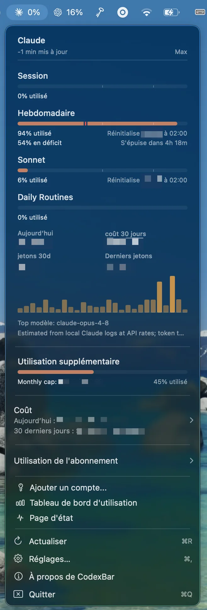

# CodexBar

[CodexBar](https://codexbar.app/) is a macOS menu bar app that tracks usage and
costs for AI coding tools, including Claude and Codex. It provides a quick
at-a-glance view of token consumption and spend without leaving the desktop.

It is installed through Homebrew and declared in the project `Brewfile`.

## Installation

It is part of the curated Homebrew environment; see [`Homebrew setup`](../homebrew/homebrew.md) to install everything at once.

Install CodexBar directly:

```bash
brew install --cask codexbar
```

After installation, open CodexBar from the Applications folder. It appears in
the menu bar and starts tracking usage automatically once configured.



## Configuration

CodexBar connects to AI provider APIs using your credentials:

- **Claude / Anthropic** — provide your Anthropic API key or account token.
- **OpenAI / Codex** — provide your OpenAI API key.

Enter credentials in CodexBar preferences. Keys are stored in the macOS
Keychain and are never committed to any repository.

## What it tracks

| Metric | Description |
| --- | --- |
| Token usage | Input, output, and cached tokens per session |
| Estimated cost | Real-time cost estimate based on provider pricing |
| Daily / monthly totals | Cumulative usage across sessions |
| Model breakdown | Usage split by model (Sonnet, Opus, GPT-4o, etc.) |

## Relationship With AI Assistants

CodexBar is a companion app for AI coding tools. It stays in the menu bar and
provides a persistent overview of token usage and estimated cost while Claude,
Codex, and other assistants are used throughout the day.

## Rollback

Remove CodexBar with Homebrew:

```bash
brew uninstall --cask codexbar
```

Then remove its entry from `profiles/full/Brewfile`.

Credentials stored in the macOS Keychain are not removed automatically. Remove
them manually from `Keychain Access` if needed.

---

[← Docs index](../README.md) · [Project README](../../README.md)
