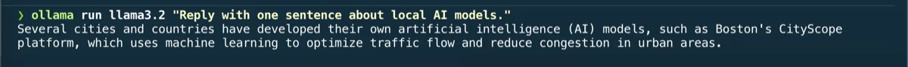

# Ollama

[Ollama](https://ollama.com/) runs large language models locally on your Mac.
It is used for privacy-sensitive tasks, offline work, and local API integrations
where sending data to a cloud service is not acceptable.

It is installed through Homebrew and declared in the project `Brewfile`.

## Installation

It is part of the curated Homebrew environment; see [`Homebrew setup`](../homebrew/homebrew.md) to install everything at once.

Install Ollama directly:

```bash
brew install --cask ollama-app
```

Start the Ollama service:

```bash
ollama serve
```

Ollama can also be launched from the Applications folder and will run as a menu
bar app.

## Pulling a model

Download a model before using it:

```bash
ollama pull mistral
ollama pull llama3.2
ollama pull phi4-mini
```

List downloaded models:

```bash
ollama list
```

## Running a model

Start an interactive session:

```bash
ollama run mistral
```

Run a one-shot prompt:

```bash
echo "Explain PHP generators in one paragraph." | ollama run mistral
```



## Local API

Ollama exposes a local HTTP API on port 11434:

```bash
curl http://localhost:11434/api/generate \
  -d '{"model": "mistral", "prompt": "Hello", "stream": false}'
```

This API is compatible with many tools that support OpenAI-style endpoints.

## Disk usage

Models are stored in `~/.ollama/models`. They are large (2–30 GB each
depending on the model). Remove unused models to free disk space:

```bash
ollama rm llama3.2
```

Check disk usage:

```bash
du -sh ~/.ollama/models
```

## When to use Ollama vs cloud AI

| Situation | Tool |
| --- | --- |
| Sensitive data that must not leave the machine | Ollama |
| Offline work | Ollama |
| Local Symfony integration and testing | Ollama |
| Complex reasoning or large context | Claude / a frontier cloud model |
| Fastest iteration speed | Claude Code / Codex |

## Rollback

Stop the Ollama service first, then remove the app:

```bash
brew uninstall --cask ollama-app
```

Remove downloaded models and data:

```bash
rm -rf ~/.ollama
```

Then remove its entry from `profiles/full/Brewfile`.

---

[← Docs index](../README.md) · [Project README](../../README.md)
