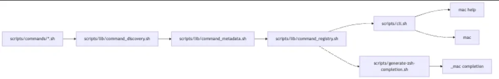

# CLI discovery architecture

The `mac` CLI is a shell-based command dispatcher. It keeps command discovery,
help output, command execution, and Zsh completion generation on the same
registry path so new commands can be added without editing the dispatcher.



## Components

- `scripts/cli.sh` is the executable entry point installed as `mac`.
- `scripts/commands/` contains executable command scripts.
- `scripts/lib/command_metadata.sh` extracts command metadata from leading
  comments.
- `scripts/lib/command_registry.sh` builds and queries the command registry.
- `scripts/lib/command_discovery.sh` exposes the registry through dispatcher
  functions.
- `scripts/generate-zsh-completion.sh` renders `configs/zsh/completions/_mac`
  from the registry.

## Auto-discovery

Commands are discovered from executable files in `scripts/commands/`.

`command_registry_build` iterates over direct children of the commands
directory, ignores non-files and non-executable files, and derives the default
command name from the filename without its extension. For example:

```text
scripts/commands/doctor.sh -> doctor
```

Each command may override its public name with a leading metadata comment:

```bash
# @name doctor
# @description Run system diagnostics for the macOS development setup.
```

The metadata parser reads only the initial comment block after an optional
shebang. Parsing stops at the first non-comment, non-empty line, which keeps
runtime command code out of the discovery contract.

## Registry system

The registry is generated on demand. There is no persisted command database.

Each registry record contains three tab-separated fields:

```text
command_name<TAB>command_path<TAB>command_description
```

`scripts/lib/command_registry.sh` owns this format and provides the public
operations:

- build all records for a commands directory;
- find a record by command name;
- extract the command name, path, or description from a record;
- resolve a command path;
- test whether a command exists.

`scripts/lib/command_discovery.sh` is a thin compatibility layer over the
registry. The dispatcher calls `command_exists` and `command_script_path`
instead of scanning the filesystem directly.

`scripts/cli.sh` uses the registry for:

- `mac help`, including command descriptions;
- command lookup before execution;
- unknown-command suggestions based on command names.

When a command is found, the dispatcher executes the resolved script with Bash
and forwards all remaining arguments unchanged.

## Completion system

Zsh completions are generated, not handwritten.

`scripts/generate-zsh-completion.sh` sources the registry, builds the command
list from `scripts/commands/`, and writes `configs/zsh/completions/_mac`.
Generated entries use Zsh's `command:description` format so `_describe` can show
both the command name and summary.

The generated completion function has two behaviors:

- at argument position 2, complete registered `mac` commands plus `help`;
- after a command is selected, fall back to `_files`.

The generator writes to a temporary file, compares it with the existing
completion file, and replaces the file only when content changes. This avoids
unnecessary churn in generated output.

## Adding a command

To add a command:

1. create an executable script in `scripts/commands/`;
2. add a concise leading `# Description:` or `# @description` comment;
3. run `scripts/generate-zsh-completion.sh` to refresh Zsh completion.

No change is required in `scripts/cli.sh` for normal commands. The only
dispatcher-owned commands are help aliases: `help`, `--help`, and `-h`.

## Design constraints

- Discovery is single-directory and non-recursive.
- Only executable files are eligible commands.
- Command names must be unique after metadata overrides.
- Registry fields are tab-separated; command metadata should not contain tabs.
- Completion is a generated artifact and should not be edited by hand.

---

[← Docs index](../README.md) · [Project README](../../README.md)
