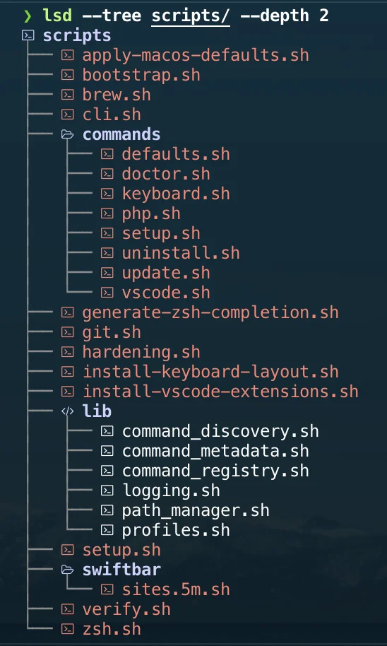

# Current architecture

MacDevSetup is organized around a small shell CLI and a profile-based package
inventory.

## Entry points

- `install.sh` installs or updates the checkout and creates the `mac` symlink.
- `scripts/cli.sh` dispatches `mac` commands.
- `scripts/commands/` contains the public command implementations.
- `scripts/setup.sh` is the internal setup runner used by `mac setup`.

## Package profiles

Homebrew packages are declared under `profiles/<name>/Brewfile`.

- `profiles/minimal/Brewfile` contains the smaller command-line setup.
- `profiles/full/Brewfile` contains the complete curated workstation setup.
- The root `Brewfile` links to `profiles/full/Brewfile` for compatibility with
  common `brew bundle --file=Brewfile` workflows.

Profile names are validated in `scripts/lib/profiles.sh`.

## Managed user files

`mac setup` may install versioned Git and Zsh configuration.

Zsh files are copied from `configs/zsh/` to the user's home directory. Existing
files are backed up first when their content differs from the versioned files.

Git is configured through a global `include.path` entry that points at
`configs/git/.gitconfig`. Other global includes are left untouched.

## Generated files

`configs/zsh/completions/_mac` is generated from the command registry by
`scripts/generate-zsh-completion.sh`.

The CI workflow checks that the committed completion file is up to date.

## Quality gates

Local and CI validation are centered on:

- `npm test` for quick CLI smoke tests;
- `pre-commit run --all-files` for formatting, markdown, links, secrets, and
  workflow linting;
- macOS workflows for Homebrew and setup validation.

## See also

- [CLI command discovery](cli-discovery.md) — how `mac` finds, names, and
  documents its subcommands from the `scripts/commands/` directory.

---

[← Docs index](../README.md) · [Project README](../../README.md)
