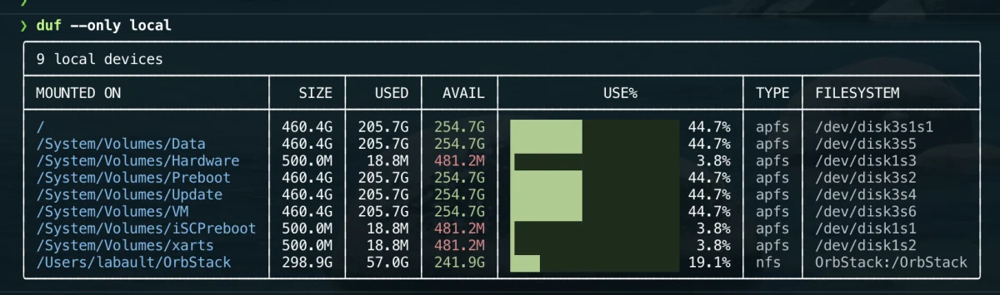

# duf

[duf](https://github.com/muesli/duf) is a command-line disk usage viewer.

It provides a clearer and more readable alternative to the standard `df` command for inspecting mounted filesystems and available storage space.

The tool is installed through Homebrew and declared in the project `Brewfile`.



## Installation

It is part of the curated Homebrew environment; see [`Homebrew setup`](../homebrew/homebrew.md) to install everything at once.

Install duf directly:

```bash
brew install duf
```

Verify the installation:

```bash
duf --version
brew list --formula | grep -x duf
```

## Usage

Display mounted filesystems:

```bash
duf
```

Display only local filesystems:

```bash
duf --only local
```

Display information for a specific path:

```bash
duf .
```

Display all filesystems, including pseudo and special filesystems:

```bash
duf --all
```

## Relationship with dust

`duf` and `dust` solve different problems:

- `duf` shows available and used space for mounted filesystems;
- `dust` shows which directories and files consume space.

A useful diagnostic workflow is:

```bash
duf
dust -d 2 .
```

Use `duf` first to identify a nearly full volume, then use `dust` to locate the largest directories.

## Useful use cases

duf is useful for checking:

- the main macOS filesystem;
- external drives;
- mounted disk images;
- network volumes;
- removable storage;
- available space before large Docker image pulls or builds.

## Safety

duf is read-only.

It displays filesystem information and does not delete or modify files.

## Troubleshooting

Display the available options:

```bash
duf --help
```

Confirm the executable path:

```bash
command -v duf
```

If a volume is missing, verify that it is currently mounted in Finder or with:

```bash
mount
```

## Rollback

Remove duf with Homebrew:

```bash
brew uninstall duf
```

Then remove its entry from `profiles/full/Brewfile`.
