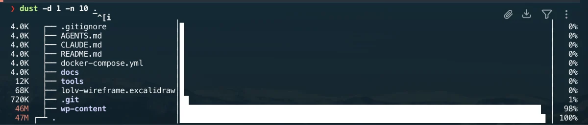

# dust

[dust](https://github.com/bootandy/dust) is a command-line disk usage analyzer.

It provides a more readable overview than the standard `du` command and helps identify large files and directories quickly.

The tool is installed through Homebrew and declared in the project `Brewfile`.



## Installation

It is part of the curated Homebrew environment; see [`Homebrew setup`](../homebrew/homebrew.md) to install everything at once.

Install dust directly:

```bash
brew install dust
```

Verify the installation:

```bash
dust --version
brew list --formula | grep -x dust
```

## Usage

Analyze the current directory:

```bash
dust
```

Analyze a specific directory:

```bash
dust ~/Library
```

Limit the displayed directory depth:

```bash
dust -d 2 .
```

Display a limited number of results:

```bash
dust -n 20 .
```

Analyze multiple paths:

```bash
dust ~/Downloads ~/Documents
```

## Useful use cases

dust is useful for inspecting:

- project dependencies;
- Docker and container data;
- package manager caches;
- macOS Library directories;
- large download folders;
- build artifacts.

Examples:

```bash
dust -d 2 ~/Library
dust -d 3 ~/Documents
dust -d 2 ~/.cache
```

Large system or protected directories may require additional permissions.

## Safety

dust only analyzes disk usage.

It does not delete files or modify directories.

Any cleanup must be performed manually after reviewing the reported paths.

Do not delete unfamiliar files from macOS system or Library directories without understanding their purpose.

## Troubleshooting

Display the available options:

```bash
dust --help
```

Confirm that the Homebrew binary is available:

```bash
command -v dust
```

Refresh the shell command cache if necessary:

```bash
rehash
```

## Rollback

Remove dust with Homebrew:

```bash
brew uninstall dust
```

Then remove its entry from `profiles/full/Brewfile`.

---

[← Docs index](../README.md) · [Project README](../../README.md)
