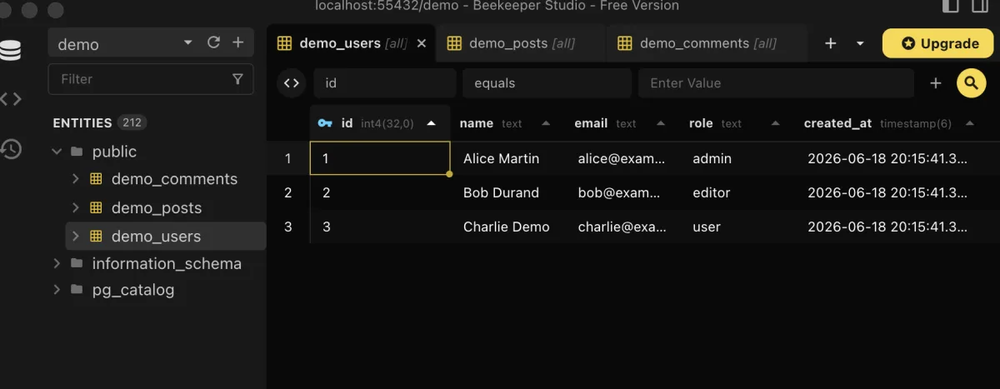

# Beekeeper Studio

Beekeeper Studio is a graphical database client for browsing, querying, and administering SQL databases.

It is included in this setup as the preferred desktop tool for working with local and remote databases.



## Installation

Beekeeper Studio is installed through Homebrew Cask:

```bash
brew install --cask beekeeper-studio
```

It is part of the curated Homebrew environment; see [`Homebrew setup`](../homebrew/homebrew.md) to install everything at once.

## Launch the application

Open Beekeeper Studio from the Applications folder or with:

```bash
open -a "Beekeeper Studio"
```

## Verify the installation

Check that the application is installed through Homebrew:

```bash
brew list --cask beekeeper-studio
```

For this setup, it is primarily intended for PostgreSQL databases used by Symfony projects.

## PostgreSQL connections

A typical local PostgreSQL connection requires:

```text
Host: localhost
Port: 5432
Database: <database-name>
User: <database-user>
Password: <database-password>
```

When PostgreSQL runs inside a container, the host port published by Docker Compose must be used.

For example:

```yaml
ports:
  - "5432:5432"
```

The matching Beekeeper Studio connection uses:

```text
Host: localhost
Port: 5432
```

## Connection security

Do not commit database credentials to the repository.

Passwords and production connection details should remain outside tracked configuration files.

For remote databases:

- prefer encrypted connections;
- use SSH tunnelling when appropriate;
- avoid exposing database ports publicly;
- use a dedicated database account with only the required permissions.

## Production databases

Direct production access should be treated carefully.

Before modifying production data:

1. Confirm that the correct environment and database are selected.
2. Prefer read-only credentials for inspection tasks.
3. Back up important data before destructive operations.
4. Review every `UPDATE`, `DELETE`, or schema-changing query before execution.
5. Use an explicit transaction when possible.

## Saved connections and local data

Beekeeper Studio stores application preferences and saved connections in the user's macOS Library.

Before reinstalling or migrating the application, back up its local application data when saved connections are important.

The exact storage location can vary between application versions, so it should be verified on the current machine before copying files.

## Updates

Update Beekeeper Studio through Homebrew with:

```bash
brew upgrade --cask beekeeper-studio
```

After updating, verify that saved connections and database drivers still work as expected.

## Rollback

Before uninstalling Beekeeper Studio, export or record any connection information that must be preserved.

Remove the application with:

```bash
brew uninstall --cask beekeeper-studio
```

Then remove its entry from `profiles/full/Brewfile`.

Homebrew may leave user-specific application data in the macOS Library. Delete that data only after confirming that saved connections, preferences, and local information are no longer needed.

---

[← Docs index](../README.md) · [Project README](../../README.md)
