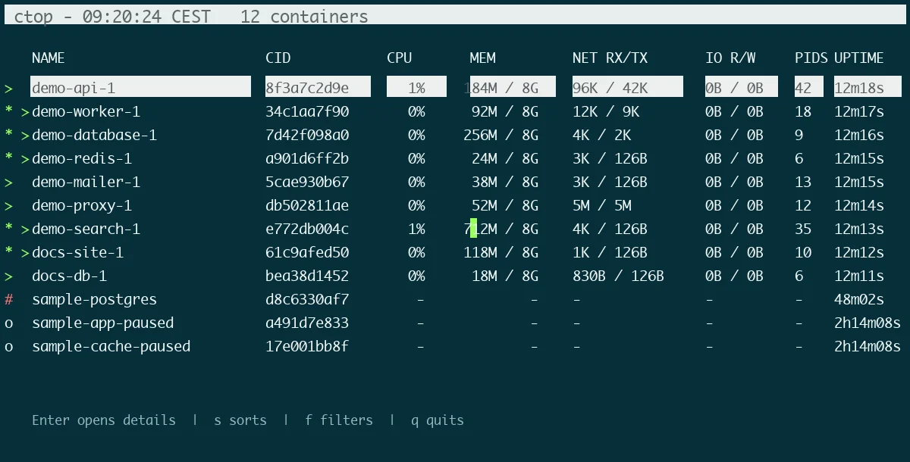

# ctop

[ctop](https://github.com/bcicen/ctop) is an interactive terminal dashboard
for monitoring Docker containers.

It displays container status, CPU usage, memory usage, network activity, and
process information.

The tool is installed through Homebrew and declared in the project `Brewfile`.

## Installation

It is part of the curated Homebrew environment; see [`Homebrew setup`](../homebrew/homebrew.md) to install everything at once.

Install ctop directly:

```bash
brew install ctop
```

Verify the installation:

```bash
ctop -v
brew list --formula | grep -x ctop
```

## OrbStack compatibility

ctop expects the default Docker socket:

```text
/var/run/docker.sock
```

OrbStack uses a different socket associated with the `orbstack` Docker
context.

The managed Zsh profile exports `DOCKER_HOST` automatically when the OrbStack
socket exists:

```bash
export DOCKER_HOST="unix://$HOME/.orbstack/run/docker.sock"
```

After applying the managed profile, reload it:

```bash
source ~/.zprofile
```

Display the OrbStack Docker endpoint:

```bash
docker context inspect orbstack \
  --format '{{.Endpoints.docker.Host}}'
```

Run ctop normally:

```bash
ctop
```

## Usage

Launch the dashboard:

```bash
ctop
```



Common controls include:

```text
q       Quit
Enter   Open the selected container view
s       Sort containers
f       Filter containers
```

The exact shortcuts can be displayed from the built-in help screen.

## Useful use cases

ctop is useful for:

- monitoring several containers at once;
- checking container restart loops;
- diagnosing a local Docker Compose environment.

## Relationship with other tools

ctop complements other container tools:

- `docker ps` lists containers;
- `docker stats` displays live resource usage;
- OrbStack provides a graphical interface;
- ctop provides a compact interactive terminal dashboard.

## Troubleshooting

Confirm that OrbStack is running:

```bash
orbctl status
```

Verify that Docker can communicate with OrbStack:

```bash
docker info
```

Display the active Docker context:

```bash
docker context show
```

Display the OrbStack socket:

```bash
docker context inspect orbstack \
  --format '{{.Endpoints.docker.Host}}'
```

If ctop still tries to connect to `/var/run/docker.sock`, verify that the
managed profile has been reloaded and that `DOCKER_HOST` points to the OrbStack
socket:

```bash
echo "$DOCKER_HOST"
```

## Safety

ctop can expose container management actions from its interface.

Before stopping, restarting, or removing a container, verify that it does not
contain important transient work or production data.

## Rollback

Remove ctop with Homebrew:

```bash
brew uninstall ctop
```

Then remove its entry from `profiles/full/Brewfile`.

---

[← Docs index](../README.md) · [Project README](../../README.md)
