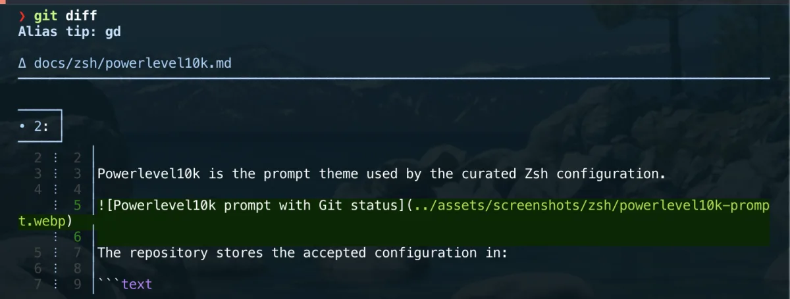

# git-delta

[delta](https://github.com/dandavison/delta) is a syntax-highlighting pager for
Git, diff, and grep output.

It improves the readability of changes, commit history, and side-by-side diffs
directly in the terminal.

The tool is installed through Homebrew and declared in the project `Brewfile`.

## Installation

It is part of the curated Homebrew environment; see [`Homebrew setup`](../homebrew/homebrew.md) to install everything at once.

Install delta directly:

```bash
brew install git-delta
```

Verify the installation:

```bash
delta --version
brew list --formula | grep -x git-delta
```

## Git integration

In this setup, delta is **already configured** by the versioned
`configs/git/.gitconfig` (see [Git setup](git.md)), which sets it as the pager,
the interactive diff filter, and enables navigation and line numbers. Once that
file is included in your global config, no extra step is needed.

The manual commands below are only for using delta **outside** this repository's
configuration (e.g. on a machine where you have not included `.gitconfig`):

```bash
git config --global core.pager delta
git config --global interactive.diffFilter 'delta --color-only'
git config --global delta.navigate true
git config --global delta.line-numbers true
```

## Recommended configuration

The versioned `configs/git/.gitconfig` already contains the equivalent of:

```gitconfig
[core]
    pager = delta

[interactive]
    diffFilter = delta --color-only

[delta]
    navigate = true
    line-numbers = true
    side-by-side = false

[merge]
    conflictStyle = zdiff3
```

The exact visual settings can be adjusted later without changing the tool
installation.

## Usage

Display a diff through delta:

```bash
git diff
```



Display staged changes:

```bash
git diff --staged
```

Inspect a commit:

```bash
git show
```

Review recent history with patches:

```bash
git log -p
```

Once configured as the Git pager, these commands use delta automatically.

## Direct usage

Pipe a diff directly into delta:

```bash
diff -u old-file new-file | delta
```

Display delta options:

```bash
delta --help
```

## Navigation

When `delta.navigate` is enabled, use:

```text
n   Move to the next file or hunk
N   Move to the previous file or hunk
q   Quit the pager
```

Navigation depends on the active pager and terminal environment.

## Side-by-side mode

Enable side-by-side rendering temporarily:

```bash
git -c delta.side-by-side=true diff
```

Enable it globally:

```bash
git config --global delta.side-by-side true
```

Side-by-side mode is useful on wide terminals but can be uncomfortable on
smaller windows.

## Themes

List available syntax themes:

```bash
delta --list-syntax-themes
```

Test a theme:

```bash
git -c delta.syntax-theme='<theme-name>' diff
```

Theme selection should remain readable in both the terminal background and the
selected macOS appearance.

## Relationship with Git

delta does not replace Git.

It only formats output produced by commands such as:

- `git diff`;
- `git show`;
- `git log`;
- `git blame`;
- interactive staging commands.

Git remains fully functional if delta is removed, provided the pager
configuration is also reverted.

## Troubleshooting

Confirm the active Git pager:

```bash
git config --global --get core.pager
```

Confirm the interactive diff filter:

```bash
git config --global --get interactive.diffFilter
```

Bypass delta temporarily:

```bash
git --no-pager diff
```

Disable the configured pager temporarily:

```bash
GIT_PAGER=cat git diff
```

## Rollback

Remove the Git configuration:

```bash
git config --global --unset core.pager
git config --global --unset interactive.diffFilter
git config --global --remove-section delta 2>/dev/null || true
```

Remove delta with Homebrew:

```bash
brew uninstall git-delta
```

Then remove its entry from `profiles/full/Brewfile`.
