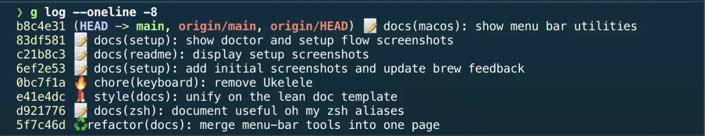
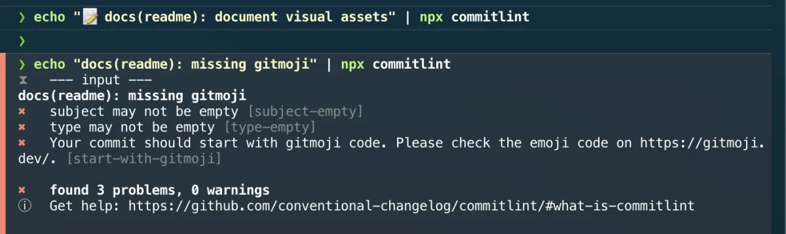

# Gitmoji

[Gitmoji](https://gitmoji.dev/) is a convention that prefixes each commit
message with an emoji describing the intent of the change. The emoji gives an
at-a-glance summary of what a commit does before you read the text.

This repository uses Gitmoji on top of
[Conventional Commits](https://www.conventionalcommits.org/), so every commit
follows the same shape and the history stays scannable.

## Commit format

Each commit header combines a Gitmoji, a Conventional Commit type, an optional
scope, and a subject:

```text
<emoji> <type>(<scope>): <subject>
```

Examples:

```text
✨ feat(php): manage xdebug config
📝 docs(readme): document installation and rollback
🐛 fix(doctor): correct the missing-tool exit code
🔧 chore(docs): stabilize swaks reference link
```

The scope is optional; the emoji, type, and subject are required.

## How it is enforced

The format is validated automatically by a small shell linter,
[`scripts/lint-commit-msg.sh`](../../scripts/lint-commit-msg.sh):

- the header must start with a leading Gitmoji — as a Unicode emoji (`✨`) or as
  its code (`:sparkles:`) — checked against the exact Gitmoji list (variation
  selectors included, so `🔒️` is valid but a bare `🔒` is not);
- it must be followed by a valid Conventional Commit type, an optional
  lower-case scope, and a non-empty subject with no trailing period.

Commit messages are linted both locally (via the pre-commit `commit-msg` hook)
and in CI (the `Repository quality` job runs the linter over the pushed commit
range). A commit that omits the emoji or uses an unknown type is rejected.

## Common Gitmoji in this repository

| Emoji | Type | Used for |
| --- | --- | --- |
| ✨ | `feat` | A new tool, command, or capability |
| 📝 | `docs` | Documentation only |
| 🐛 | `fix` | A bug fix |
| ✅ | `test` | Adding or updating tests |
| 🔧 | `chore` | Configuration and tooling changes |
| ♻️ | `refactor` | Restructuring without behavior change |
| 👷 | `ci` | CI workflow changes |
| 💄 | `style` | Formatting and cosmetic doc/UI changes |
| 🔒 | `security` | Fixing or hardening a security concern |
| ⬆️ | `chore` | Upgrading dependencies |
| 🔖 | `chore` | Version bump / release tag |
| 🙈 | `chore` | Adding or updating `.gitignore` |

The full list of emojis and their meanings lives at
[gitmoji.dev](https://gitmoji.dev/). When in doubt, pick the emoji whose
description on that page best matches the change.

## Writing a commit

Choose the emoji that matches the intent, then write a Conventional Commit
subject in the imperative mood:

```bash
git commit -m "✨ feat(cli): add a profile selection flag"
git commit -m "🐛 fix(setup): handle a missing Homebrew prefix"
```

Prefer small, atomic commits with one clear purpose, so a single emoji
describes the whole change.





## Optional: gitmoji-cli

[gitmoji-cli](https://github.com/carloscuesta/gitmoji-cli) is an interactive
helper that prompts for the emoji and message instead of typing them by hand.
It is **not** part of this setup and is **not** declared in the `Brewfile` —
the convention above is all you need. If you want it anyway, install it
yourself:

```bash
brew install gitmoji        # or: npm install -g gitmoji-cli
gitmoji --commit            # interactive commit
```

## Reference

- [gitmoji.dev](https://gitmoji.dev/) — searchable list of all emojis
- [Conventional Commits](https://www.conventionalcommits.org/) — the type/scope
  grammar layered under the emoji
- [`scripts/lint-commit-msg.sh`](../../scripts/lint-commit-msg.sh) — the shell
  linter that enforces the format

---

[← Docs index](../README.md) · [Project README](../../README.md)
