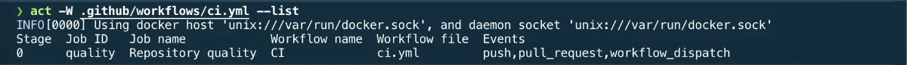

# Act

Act runs GitHub Actions workflows locally.

It provides faster feedback while developing or debugging continuous integration workflows, without requiring a commit and push for every test.

## Installation

Act is installed through Homebrew:

```bash
brew install act
```

It is part of the curated Homebrew environment; see [`Homebrew setup`](../homebrew/homebrew.md) to install everything at once.

## Container runtime

Act executes jobs inside containers and therefore requires a compatible container runtime.

This setup uses OrbStack as the local container runtime.

Before running Act, verify that the container engine is available:

```bash
docker info
```

OrbStack exposes its Docker API through a user-specific Unix socket. Some tools, including Act, do not automatically resolve the active Docker context.

The managed Zsh profile therefore exports `DOCKER_HOST` automatically when the
OrbStack socket exists:

```bash
export DOCKER_HOST="unix://$HOME/.orbstack/run/docker.sock"
```

Reload the shell configuration after applying or changing the managed profile:

```bash
source ~/.zprofile
```

Verify the resolved socket:

```bash
echo "$DOCKER_HOST"
docker info
```

## Verify the installation

Check that Act is available:

```bash
act --version
```

## List available jobs

From the root of a repository containing GitHub Actions workflows, list the jobs detected by Act:

```bash
act --list
```



Act searches for workflows under:

```text
.github/workflows/
```

## Run workflows

Run workflows triggered by the default `push` event:

```bash
act
```

Run workflows for a specific event:

```bash
act pull_request
```

Run one specific job:

```bash
act --job <job-id>
```

The job identifier is the YAML key declared under `jobs`, not its optional display name.

## Select a workflow

Run a specific workflow file with:

```bash
act --workflows .github/workflows/ci.yml
```

This is useful when a repository contains several independent workflows.

## Secrets

A secret can be passed interactively without placing its value directly in shell history:

```bash
act --secret SECRET_NAME
```

Secrets can also be loaded from a file:

```bash
act --secret-file .secrets
```

The `.secrets` file must never be committed.

Add it to `.gitignore` before using it:

```gitignore
.secrets
```

Real production credentials should be avoided whenever test-specific credentials can be used instead.

## Runner images

Act uses container images to approximate GitHub-hosted runners.

On first execution, Act may ask which image size should be used. Smaller images download faster but contain fewer preinstalled tools.

The selected image can be changed later through Act configuration.

For Apple Silicon Macs, this setup uses the `linux/amd64` architecture to remain close to GitHub-hosted Ubuntu runners.

The global Act configuration is stored in:

```text
~/Library/Application Support/act/actrc
```

It contains:

```text
--container-architecture linux/amd64
```

The medium runner image is used because the micro image does not contain enough system tools for workflows using commands such as `apt-get` or `sudo`.

## Limitations

Act does not provide a perfect reproduction of GitHub-hosted runners.

Differences can include:

- preinstalled software and package versions;
- operating system behavior;
- GitHub-specific services and authentication;
- permissions and network configuration;
- unsupported or partially supported actions;
- macOS and Windows runner behavior.

A successful local run reduces feedback time, but the workflow must still be validated on GitHub before being considered fully operational.

## Relationship with Actionlint

Actionlint validates the workflow structure and expressions without executing jobs.

Act executes the workflow jobs inside local containers.

Both tools are complementary:

```bash
actionlint
act --list
act
```

## Project integration

The repository contains a CI workflow under:

```text
.github/workflows/ci.yml
```

List the detected jobs:

```bash
act --list
```

Run the repository quality job locally:

```bash
act push --job quality
```

This command has been validated with OrbStack on an Apple Silicon Mac.

Project-specific Act configuration should only be committed when requirements are specific to this repository. The Docker socket and architecture settings remain machine-level configuration.

## Rollback

Remove Act with:

```bash
brew uninstall act
```

Then remove its entry from `profiles/full/Brewfile`.

Any project-specific Act configuration must also be reviewed and removed separately.

---

[← Docs index](../README.md) · [Project README](../../README.md)
