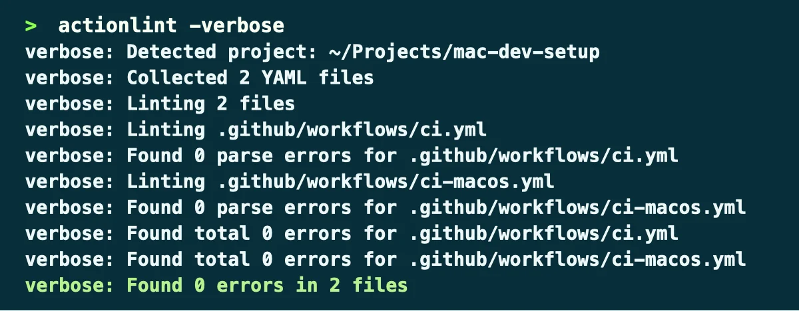

# Actionlint

Actionlint validates GitHub Actions workflow files.

It detects syntax errors, invalid expressions, incorrect event configurations, unsupported keys, and several common workflow mistakes before they reach GitHub.

## Installation

Actionlint is installed through Homebrew:

```bash
brew install actionlint
```

It is part of the curated Homebrew environment; see [`Homebrew setup`](../homebrew/homebrew.md) to install everything at once.

## Verify the installation

Check that Actionlint is available:

```bash
actionlint --version
```

## Analyze workflows

From the root of a repository, run:

```bash
actionlint
```



By default, Actionlint searches for workflow files in:

```text
.github/workflows/
```

A specific workflow can also be analyzed directly:

```bash
actionlint .github/workflows/ci.yml
```

## Output

Actionlint reports:

- the affected file;
- the line and column;
- a description of the problem;
- the relevant workflow expression or YAML fragment.

A successful validation produces no output and returns a zero exit status.

## ShellCheck integration

When ShellCheck is installed, Actionlint can use it to analyze shell commands embedded in GitHub Actions steps.

Both tools are included in this setup through Homebrew.

This provides additional validation for steps such as:

```yaml
- name: Run checks
  run: |
    echo "$VALUE"
    ./scripts/check.sh
```

## Workflow availability

The repository contains a GitHub Actions workflow under:

```text
.github/workflows/ci.yml
```

Validate all workflows manually from the repository root:

```bash
actionlint
```

A successful validation produces no output and returns a zero exit status.

## Pre-commit integration

Actionlint is integrated into the local `pre-commit` configuration.

The hook targets workflow files under:

```text
.github/workflows/
```

Run the hook directly with:

```bash
pre-commit run actionlint --all-files
```

Homebrew manages the Actionlint executable, while `pre-commit` controls when validation is executed.

Because ShellCheck is also installed, Actionlint can analyze shell commands embedded in workflow steps.

## Rollback

Remove Actionlint with:

```bash
brew uninstall actionlint
```

Then remove its entry from `profiles/full/Brewfile`.

Any related pre-commit hook must also be removed separately.
