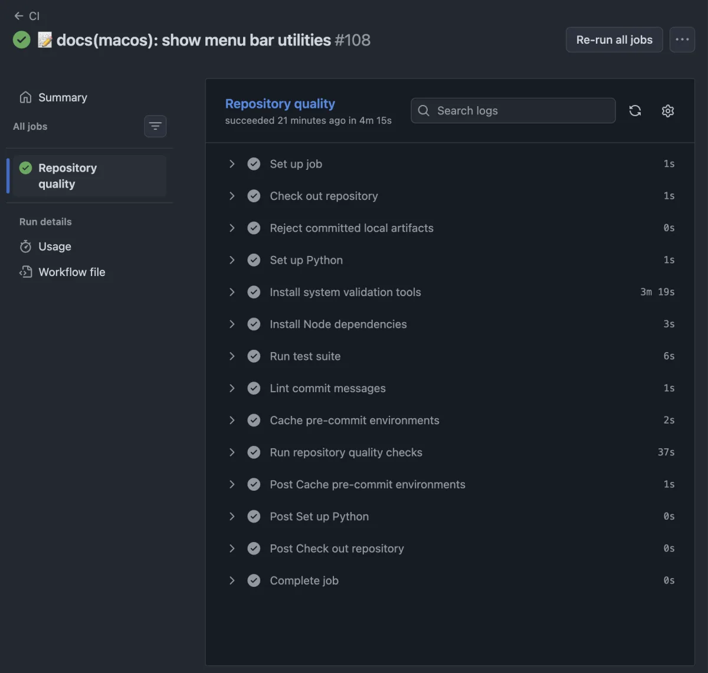

# Continuous integration

The repository uses GitHub Actions to validate its configuration, documentation, scripts, and security checks automatically.

The workflow is defined in:

```text
.github/workflows/ci.yml
```

## Triggers

The workflow runs automatically:

- on pushes to the `main` branch;
- on pull requests;
- when started manually through `workflow_dispatch`.

## Permissions

The workflow uses read-only repository permissions:

```yaml
permissions:
  contents: read
```

No write access is required for repository quality checks.

## Repository quality job

The workflow contains a `quality` job running on the latest Ubuntu GitHub-hosted runner.

Its purpose is to reproduce the repository-wide checks normally executed locally through `pre-commit`.



The workflow installs the tools required by hooks declared with:

```yaml
language: system
```

These tools include:

- `markdownlint-cli2`;
- `lychee`;
- `editorconfig-checker`;
- `actionlint`.

Hooks provided directly by remote pre-commit repositories, including Gitleaks and the standard pre-commit hooks, are installed automatically by `pre-commit`.

## Validation command

The complete repository is validated with:

```bash
pre-commit run --all-files --show-diff-on-failure
```

This keeps local and continuous integration checks aligned around the same configuration:

```text
.pre-commit-config.yaml
```

## Checks performed

The current workflow validates:

- trailing whitespace;
- missing final newlines;
- YAML syntax;
- accidentally added large files;
- unresolved merge conflict markers;
- private keys;
- hardcoded secrets with Gitleaks;
- Markdown formatting;
- documentation links;
- EditorConfig compliance;
- GitHub Actions workflow syntax.

It also verifies that the generated Zsh completion committed at
`configs/zsh/completions/_mac` is up to date.

## macOS workflows

Additional macOS workflows validate platform-specific behavior:

- `.github/workflows/brewfile.yml` installs the full Homebrew profile and runs
  verification plus hardening checks.
- `.github/workflows/ci-macos.yml` checks the setup CLI contract, installs the
  full profile once, applies setup once, and validates the resulting Brew state.
- `.github/workflows/hardening.yml` runs the hardening gate on a macOS runner
  without reinstalling Homebrew.

## Pre-commit cache

GitHub Actions caches pre-commit environments under:

```text
~/.cache/pre-commit
```

The cache key includes the operating system and a hash of:

```text
.pre-commit-config.yaml
```

Changing the pre-commit configuration therefore creates a new cache automatically.

## Validate locally

Validate the workflow structure without executing it:

```bash
actionlint .github/workflows/ci.yml
```

Run the same repository checks locally:

```bash
pre-commit run --all-files
```

Run the quality job locally with Act:

```bash
act pull_request \
  --job quality \
  --container-architecture linux/amd64 \
  -P ubuntu-latest=catthehacker/ubuntu:act-latest \
  --pull=false
```

Act provides useful local feedback but does not reproduce GitHub-hosted runners perfectly.

A successful run on GitHub Actions remains the final validation.

## Inspect GitHub Actions runs

List recent workflow executions:

```bash
gh run list \
  --workflow CI \
  --limit 5
```

Inspect the latest failed workflow logs:

```bash
gh run view --log-failed
```

## Related documentation

- [Act local GitHub Actions execution](act.md)
- [Actionlint GitHub Actions workflow validation](actionlint.md)
- [Pre-commit and Gitleaks](../pre-commit/pre-commit.md)
