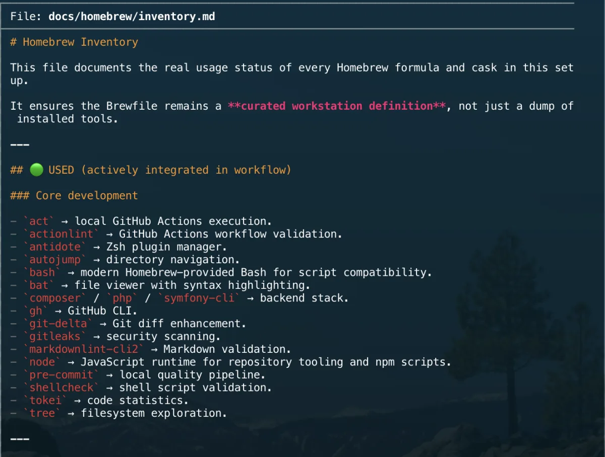
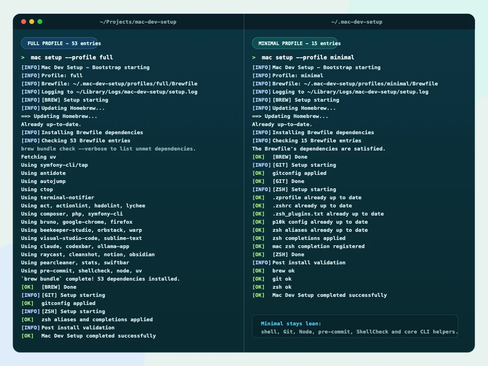

# Homebrew Inventory

This file documents the real usage status of every Homebrew formula and cask in this setup.

It ensures the Brewfile remains a **curated workstation definition**, not just a dump of installed tools.

---

## 🟢 USED (actively integrated in workflow)

### Core development

- `act` → local GitHub Actions execution.
- `actionlint` → GitHub Actions workflow validation.
- `antidote` → Zsh plugin manager.
- `autojump` → directory navigation.
- `bash` → modern Homebrew-provided Bash for script compatibility.
- `bat` → file viewer with syntax highlighting.
- `composer` / `php` / `symfony-cli` → backend stack.
- `gh` → GitHub CLI.
- `git-delta` → Git diff enhancement.
- `gitleaks` → security scanning.
- `markdownlint-cli2` → Markdown validation.
- `node` → JavaScript runtime for repository tooling and npm scripts.
- `pre-commit` → local quality pipeline.
- `shellcheck` → shell script validation.
- `tokei` → code statistics.
- `tree` → filesystem exploration.

---

### Containers

- `orbstack` → container runtime.
- `ctop` → container monitoring.
- `hadolint` → Dockerfile linting.

---

### macOS / dev UX

- `cleanshot` → screenshot and screen recording tool; annotations, scrolling capture, OCR. Licence required, activated manually.
- `gimp` → open-source image editor for manual retouching, background removal, and export.
- `notion` → collaborative workspace for notes, databases, and wikis. Used as desktop app and web.
- `obsidian` → local-first Markdown note-taking app. Personal vault stays outside this repository.
- `pearcleaner` → uninstall/cleanup tool.
- `raycast` → productivity launcher; replaces Spotlight with clipboard history, snippets, and window management.
- `swiftbar` → menu bar app runner; shell scripts in a folder become auto-refreshing menu bar items (used for VPS/site monitoring).
- `sublime-text` → fast and lightweight text editor; used for quick file edits and large file handling.
- `visual-studio-code` → editor.
- `warp` → terminal.

---

### Database

- `beekeeper-studio` → graphical SQL client.
- `libpq` → PostgreSQL client libraries and command-line tools.

---

### Browsers and API clients

- `google-chrome` → primary development browser.
- `bruno` → git-friendly API client; collections stored as plain files.

---

## 🟡 INSTALLED (optional / partial usage)

- `firefox` → secondary browser for cross-browser testing.
- `duf` → disk usage viewer.
- `dust` → alternative disk usage analyzer.
- `editorconfig-checker` → formatting enforcement.
- `lsd` → alternative `ls` replacement.
- `lychee` → link checker.
- `terminal-notifier` → notification utility.
- `tlrc` → official `tldr` client for CLI help pages.

---

### AI assistants

- `claude` → Claude desktop app by Anthropic; used for reasoning, design, and code review.
- `codexbar` → menu bar app tracking Claude and Codex usage and costs.
- `ollama-app` → run large language models locally; used for privacy-sensitive tasks and offline work.

---

## 🔴 TOOLING (not part of workflow but installed)

- `glances` → system monitor.
- `jordanbaird-ice` → menu bar manager.
- `keeweb` → password manager.
- `stats` → macOS system monitoring.

---

## 📌 Notes

- No tool is strictly forbidden.
- Everything remains installed, but only some tools are part of the **documented workflow**.
- Future goal: progressively move tools from INSTALLED → USED or remove if unnecessary.

---

## 🎯 Principle

> Installed does not mean used. Documented does not mean essential.

---

[← Docs index](../README.md) · [Project README](../../README.md)
