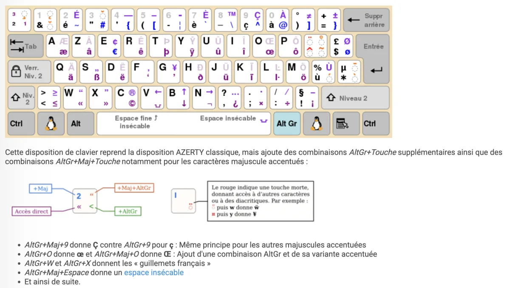

# French OSS keyboard layout

This repository includes a custom macOS keyboard layout based on the French OSS layout.

The layout keeps the familiar French AZERTY arrangement while adding easier access to programming symbols, French typography, accented characters, and additional European characters.

The versioned bundle is stored in:



```text
configs/keyboard/Francais-OSS-Mac.bundle
```

## Why use French OSS

The French OSS layout improves access to characters that are awkward or missing from the standard French Apple layout.

It is particularly useful for:

- programming symbols;
- French uppercase accented characters;
- French quotation marks;
- ligatures such as `œ` and `Œ`;
- non-breaking spaces;
- additional European characters.

A useful external overview of the French OSS layout and its modifier layers is available in the MicroZoom FR-OSS guide.

## macOS-specific bundle

This project uses a custom macOS bundle named:

```text
Francais-OSS-Mac.bundle
```

Its input source identifier is:

```text
dev.labault.keyboardlayout.francaisossmac.francaisossmac
```

The bundle includes:

```text
Contents/Info.plist
Contents/version.plist
Contents/Resources/Francais-OSS-Mac.keylayout
Contents/Resources/Francais-OSS-Mac.icns
```

The layout contains adaptations for the internal Apple keyboard, including corrections for physical key codes that differ from standard PC keyboards.

## Installation

Install the layout with the CLI:

```bash
mac keyboard
```

Or run the script directly:

```bash
./scripts/install-keyboard-layout.sh
```

The script:

- creates `~/Library/Keyboard Layouts` when necessary;
- backs up an existing installation;
- copies the versioned bundle;
- preserves the previous bundle in `~/Documents/Backups/keyboard-layouts`.

After installation:

1. log out of macOS and log back in;
2. open System Settings;
3. open Keyboard;
4. open Text Input or Input Sources;
5. add `Francais OSS Mac`;
6. select it as the current input source.

## Manual installation

The bundle can also be installed manually:

```bash
mkdir -p "$HOME/Library/Keyboard Layouts"

cp -a \
  configs/keyboard/Francais-OSS-Mac.bundle \
  "$HOME/Library/Keyboard Layouts/"
```

Log out and back in afterward.

## Validation

Check that the bundle is installed:

```bash
test -d "$HOME/Library/Keyboard Layouts/Francais-OSS-Mac.bundle" \
  && echo "French OSS keyboard layout found."
```

Inspect the selected input source:

```bash
defaults read \
  com.apple.HIToolbox \
  AppleCurrentKeyboardLayoutInputSourceID
```

Expected identifier:

```text
dev.labault.keyboardlayout.francaisossmac.francaisossmac
```

Inspect the selected keyboard layout:

```bash
defaults read com.apple.HIToolbox AppleSelectedInputSources
```

## Useful symbols

The exact shortcuts depend on the modifier layer defined by the layout.

The documentation should be completed with a visual keyboard map covering at least:

- braces: `{` and `}`;
- brackets: `[` and `]`;
- pipe: `|`;
- backslash: `\`;
- tilde: `~`;
- backtick: `` ` ``;
- French quotation marks: `«` and `»`;
- ligatures: `œ` and `Œ`;
- uppercase accented characters.

## Files that stay local

These files are not needed by the installed layout and should not be copied into the repository:

```text
~/Library/Keyboard Layouts/README.txt
~/Library/Keyboard Layouts/INSTALLATION.txt
```

They are older installation notes and may reference obsolete versions.

## Rollback

Remove the installed layout:

```bash
rm -rf \
  "$HOME/Library/Keyboard Layouts/Francais-OSS-Mac.bundle"
```

Restore a previous backup:

```bash
cp -a \
  "$HOME/Documents/Backups/keyboard-layouts/<backup-name>" \
  "$HOME/Library/Keyboard Layouts/Francais-OSS-Mac.bundle"
```

Log out and back in after restoring or removing the layout.

---

[← Docs index](../README.md) · [Project README](../../README.md)
