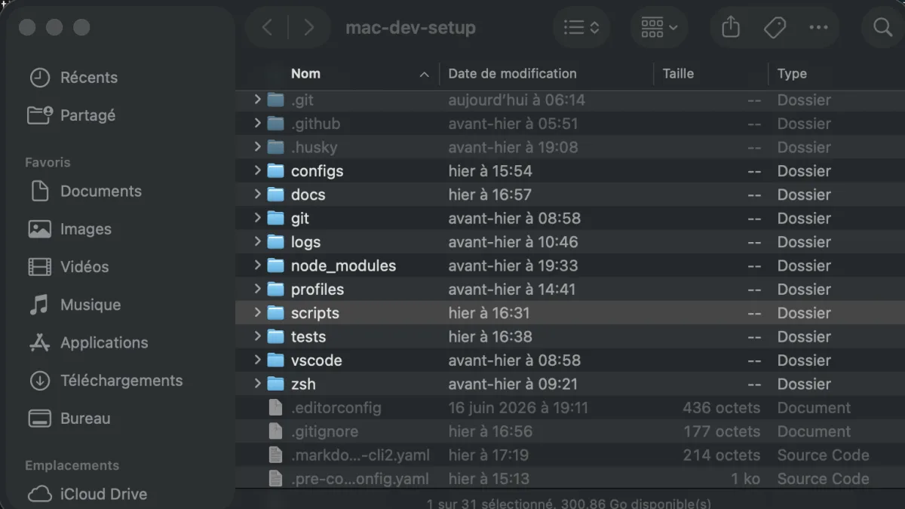

# macOS defaults

This repository includes a script that applies a curated set of macOS preferences for development and daily use.

The script is stored in:

```text
scripts/apply-macos-defaults.sh
```

## Applied settings

### Finder

The script:

- shows hidden files;
- hides the path bar;
- shows the status bar;
- displays all file extensions.

These choices make development files such as `.git`, `.env`, and `.zshrc` visible while keeping the Finder interface relatively compact.



### Dock

The script:

- enables automatic hiding;
- hides recently used applications;
- sets the icon size to `50`;
- minimizes windows into their application icon.

### Screenshots

Screenshots are stored in:

```text
~/Pictures/Screenshots
```

The directory is created automatically.

Screenshots use the PNG format and retain window shadows.

### Keyboard

Press-and-hold accent selection is disabled so that keys repeat normally in editors and terminals.

The configured repeat values are:

```text
KeyRepeat = 2
InitialKeyRepeat = 15
```

### Text substitutions

Automatic capitalization, typographic dash substitution, and smart quote substitution are disabled.

This prevents macOS from modifying code, commands, and technical text automatically.

## Usage

Review the script before applying it:

```bash
sed -n '1,240p' scripts/apply-macos-defaults.sh
```

Validate it with ShellCheck:

```bash
shellcheck scripts/apply-macos-defaults.sh
```

Apply the configuration with the CLI:

```bash
mac defaults
```

Or run the script directly:

```bash
./scripts/apply-macos-defaults.sh
```

Finder, the Dock, and SystemUIServer are restarted automatically after the settings are written.

## Validation

Inspect the Finder settings:

```bash
defaults read com.apple.finder AppleShowAllFiles
defaults read com.apple.finder ShowPathbar
defaults read com.apple.finder ShowStatusBar
defaults read NSGlobalDomain AppleShowAllExtensions
```

Inspect the Dock settings:

```bash
defaults read com.apple.dock autohide
defaults read com.apple.dock show-recents
defaults read com.apple.dock tilesize
defaults read com.apple.dock minimize-to-application
```

Inspect the screenshot settings:

```bash
defaults read com.apple.screencapture location
defaults read com.apple.screencapture type
defaults read com.apple.screencapture disable-shadow
```

Inspect the keyboard settings:

```bash
defaults read NSGlobalDomain ApplePressAndHoldEnabled
defaults read NSGlobalDomain KeyRepeat
defaults read NSGlobalDomain InitialKeyRepeat
```

Inspect the text substitution settings:

```bash
defaults read NSGlobalDomain NSAutomaticCapitalizationEnabled
defaults read NSGlobalDomain NSAutomaticDashSubstitutionEnabled
defaults read NSGlobalDomain NSAutomaticQuoteSubstitutionEnabled
```

## Rollback

The script does not currently automate rollback.

Restore a setting by deleting its explicit value or writing the preferred replacement value.

For example, restore the Finder path bar:

```bash
defaults write com.apple.finder ShowPathbar -bool true
killall Finder
```

Delete an explicit preference to allow macOS to use its default behavior:

```bash
defaults delete NSGlobalDomain KeyRepeat
defaults delete NSGlobalDomain InitialKeyRepeat
```

Some changes may require restarting the affected application or logging out of the macOS session.
