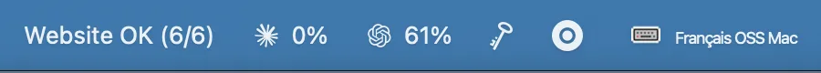
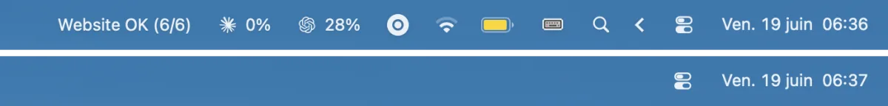
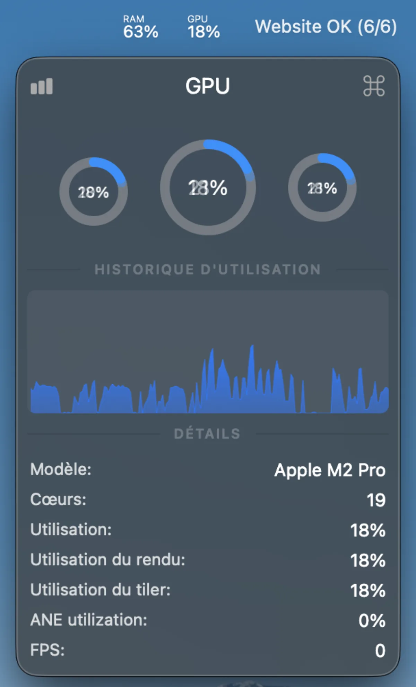
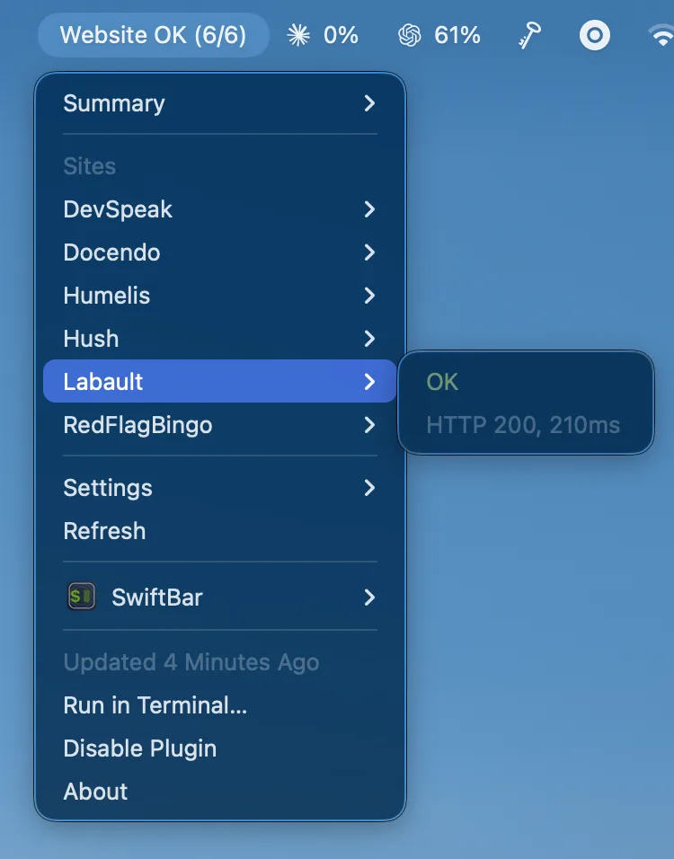

# Menu bar utilities

This page covers the three menu bar tools in this setup: **Ice** organizes the
menu bar, **Stats** shows system metrics, and **SwiftBar** turns shell scripts
into menu bar items (used here for uptime monitoring). All three are installed
through Homebrew and declared in the project `Brewfile`; see
[`Homebrew setup`](../homebrew/homebrew.md) to install everything at once.



## Ice

[Ice](https://icemenubar.app/) is a macOS menu bar manager. It is installed as
`jordanbaird-ice` and helps keep menu bar utilities readable when several
development tools are running.

### Installation

```bash
brew install --cask jordanbaird-ice
```

Verify the installation:

```bash
brew list --cask jordanbaird-ice
```

### Usage

Open Ice from Applications or with:

```bash
open -a Ice
```

Use it to hide low-priority menu bar icons and keep important indicators
visible. The exact menu bar layout is user-specific and is not versioned in
this repository.



### Rollback

```bash
brew uninstall --cask jordanbaird-ice
```

## Stats

[Stats](https://github.com/exelban/stats) is a macOS menu bar system monitor.
It displays CPU, memory, disk, network, battery, and sensor information without
opening a terminal.

### Installation

```bash
brew install --cask stats
```

Verify the installation:

```bash
brew list --cask stats
```

### Usage

Open Stats from Applications or with:

```bash
open -a Stats
```

Use it for quick local resource checks before reaching for terminal tools such
as `glances` or `ctop`. Preferences are stored in the user's Library and are
not versioned, as they include machine-specific sensor choices.



### Rollback

```bash
brew uninstall --cask stats
```

## SwiftBar

[SwiftBar](https://swiftbar.app/) turns any shell script into a macOS menu bar
item. Every script in a designated folder runs on a configurable schedule and
its output is shown in the menu bar. It is used here for lightweight VPS and
website uptime monitoring — no external service or background daemon required.

### Installation

```bash
brew install --cask swiftbar
```

On first launch, SwiftBar asks for a **Plugin Directory** — a folder where it
looks for scripts. Choose a versioned location:

```text
~/Documents/swiftbar-plugins/
```

### Script naming convention

The filename encodes the refresh interval:

```text
uptime.5m.sh      # every 5 minutes
memory.30s.sh     # every 30 seconds
disk.1h.sh        # every hour
```

Supported units: `s` (seconds), `m` (minutes), `h` (hours), `d` (days).

### Writing a plugin

Every script must be executable and print to stdout. The first line becomes the
menu bar title; lines after `---` become dropdown items.

```bash
#!/bin/bash
# uptime.5m.sh — check HTTP status of a site

STATUS=$(curl -s -o /dev/null -w "%{http_code}" https://example.com)

if [ "$STATUS" = "200" ]; then
  echo "✅ example.com"
else
  echo "🔴 example.com ($STATUS)"
fi
```

Make the script executable:

```bash
chmod +x ~/Documents/swiftbar-plugins/uptime.5m.sh
```

SwiftBar picks it up automatically; no restart required.

### Multi-site monitoring

Check multiple sites from a single script to keep the menu bar compact:

```bash
#!/bin/bash
# sites.5m.sh

SITES=(
  "https://example.com"
  "https://api.example.com/health"
)

ALL_OK=true
DETAIL="---"

for URL in "${SITES[@]}"; do
  CODE=$(curl -s -o /dev/null -w "%{http_code}" --max-time 5 "$URL")
  if [ "$CODE" = "200" ]; then
    DETAIL="$DETAIL\n✅ $URL"
  else
    DETAIL="$DETAIL\n🔴 $URL ($CODE)"
    ALL_OK=false
  fi
done

if $ALL_OK; then
  echo "✅ Sites"
else
  echo "🔴 Sites"
fi

printf "%b\n" "$DETAIL"
```

This repository also ships a reusable plugin:

```bash
mkdir -p ~/Documents/swiftbar-plugins
mkdir -p ~/.config/swiftbar
ln -sf "$PWD/scripts/swiftbar/sites.5m.sh" ~/Documents/swiftbar-plugins/sites.5m.sh
cp configs/swiftbar/sites.conf.example ~/.config/swiftbar/sites.conf
chmod +x scripts/swiftbar/sites.5m.sh
```

Run these from the repository root so `$PWD` resolves to the checkout. Then edit
the local config:

```text
~/.config/swiftbar/sites.conf
```

Keep configuration files outside `~/Documents/swiftbar-plugins/`. SwiftBar may
automatically mark files in its plugin directory as executable, so non-plugin
files can appear as broken `?` menu bar items.

Each non-comment line follows this format:

```text
label|url|expected_statuses|timeout_seconds|slow_threshold_ms
```

Example:

```text
Homepage|https://example.com|200|8|1500
API Health|https://api.example.com/health|200,204|5|800
Redirect Check|https://example.com/login|200,302|8|1500
```

The plugin shows `Website OK` when every check matches the expected HTTP status,
and `Website FAIL` when at least one site times out or returns an unexpected
status. The `slow_threshold_ms` field is optional and defaults to `1500`.
Dropdown rows are clickable and open the checked URL. The dropdown also shows
the average response time, number of slow sites, slowest site, and last check
time.



### Dropdown actions

Lines after `---` in the script output can be made interactive with SwiftBar
parameters such as `refresh`, `href`, and `bash` (run a script on click):

```text
---
Refresh now | refresh=true
Open dashboard | href=https://example.com/dashboard
Run backup | bash=/path/to/backup.sh terminal=false
```

### Hiding a plugin temporarily

Rename the file with a leading `.` to disable it without deleting it:

```bash
mv uptime.5m.sh .uptime.5m.sh
```

### Rollback

```bash
brew uninstall --cask swiftbar
```

Plugin scripts in the plugin directory are not removed automatically.

## Rollback (all)

After uninstalling any of these casks, remove its entry from
`profiles/full/Brewfile`.
