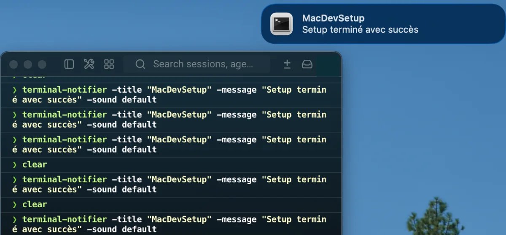

# terminal-notifier

[terminal-notifier](https://github.com/julienXX/terminal-notifier) sends macOS notifications from shell scripts.

It is installed for lightweight local feedback after long-running commands.

The tool is installed through Homebrew and declared in the project `Brewfile`.

## Installation

It is part of the curated Homebrew environment; see [`Homebrew setup`](../homebrew/homebrew.md) to install everything at once.

Install terminal-notifier directly:

```bash
brew install terminal-notifier
```

Verify the installation:

```bash
terminal-notifier --version
brew list --formula | grep -x terminal-notifier
```

## Usage

Send a notification:



```bash
terminal-notifier -title "Build" -message "Done"
```

Notify after a command:

```bash
npm test && terminal-notifier -title "Tests" -message "Passed"
```

## Permissions

macOS may ask for notification permission the first time the tool sends a notification.

If notifications do not appear, check:

```text
System Settings -> Notifications
```

## Rollback

Remove terminal-notifier with:

```bash
brew uninstall terminal-notifier
```

---

[← Docs index](../README.md) · [Project README](../../README.md)
