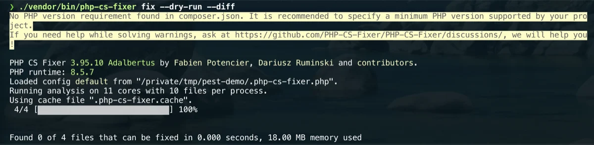

# PHP Coding Standards

Use automated formatting and refactoring to keep PHP projects consistent:

- PHP-CS-Fixer for formatting and style normalization;
- Rector for controlled upgrades and mechanical refactors.

Both tools belong in each PHP project as Composer development dependencies. Do
not install them globally for this setup.

## PHP-CS-Fixer

Install per project:

```bash
composer require --dev friendsofphp/php-cs-fixer
```

Create `.php-cs-fixer.dist.php` in the project:

```php
<?php

$finder = PhpCsFixer\Finder::create()
    ->in(__DIR__ . '/src')
    ->in(__DIR__ . '/tests');

return (new PhpCsFixer\Config())
    ->setRiskyAllowed(true)
    ->setRules([
        '@Symfony' => true,
        'declare_strict_types' => true,
        'ordered_imports' => true,
    ])
    ->setFinder($finder);
```

Add Composer scripts:

```json
{
  "scripts": {
    "cs": "php-cs-fixer fix --dry-run --diff",
    "cs:fix": "php-cs-fixer fix"
  }
}
```



## Rector

Install per project:

```bash
composer require --dev rector/rector
```

Create `rector.php`:

```php
<?php

use Rector\Config\RectorConfig;

return RectorConfig::configure()
    ->withPaths([
        __DIR__ . '/src',
        __DIR__ . '/tests',
    ])
    ->withPreparedSets(
        deadCode: true,
        codeQuality: true
    );
```

Add scripts:

```json
{
  "scripts": {
    "rector": "rector process --dry-run",
    "rector:fix": "rector process"
  }
}
```

## Review rule

Never auto-run Rector as an invisible setup step. Run it manually, inspect the
diff, and commit the result separately from behavior changes.

## Pre-commit boundary

It is reasonable for a project to run PHP-CS-Fixer checks in pre-commit. Rector
should stay manual or run in a dedicated CI job because it rewrites code.
