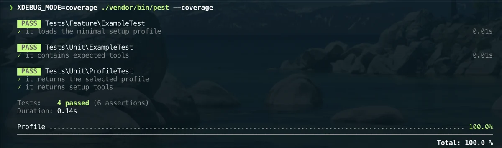

# PHP Coverage

Use coverage to measure which code paths are exercised by the test suite.

For this setup:

- Xdebug is for debugging and profiling;
- PCOV is the preferred coverage driver when a project needs fast coverage;
- never enable PCOV and Xdebug coverage in the same test run.

Coverage tooling belongs in each PHP project, not in the shared Homebrew
profile.

## PCOV installation

Install PCOV for the active PHP runtime:

```bash
pecl install pcov
```

Keep PCOV disabled by default unless the project test command enables it
explicitly.

An example disabled config:

```ini
; pcov.ini.disabled
extension=pcov
pcov.enabled=0
pcov.directory=src
```

## Pest and PHPUnit coverage

Project test runners can request coverage when the extension is available:

```bash
XDEBUG_MODE=off php -d pcov.enabled=1 vendor/bin/pest --coverage
```



Generate Clover XML for CI tooling:

```bash
XDEBUG_MODE=off php -d pcov.enabled=1 vendor/bin/pest --coverage-clover=coverage.xml
```

Generate an HTML report for local inspection:

```bash
XDEBUG_MODE=off php -d pcov.enabled=1 vendor/bin/pest --coverage-html=coverage
```

For PHPUnit directly, use the equivalent `--coverage-*` flags supported by the
project's PHPUnit version.

## Benchmarking

Before adopting coverage defaults in a project, measure three runs:

```bash
composer test
XDEBUG_MODE=coverage vendor/bin/pest --coverage
XDEBUG_MODE=off php -d pcov.enabled=1 vendor/bin/pest --coverage
```

Record:

- wall-clock runtime;
- memory usage if available;
- whether HTML and Clover reports are required;
- any code that needs explicit inclusion or exclusion.

## CI boundary

Run coverage in a dedicated CI command or job when it is expensive. Keep the
normal `composer test` command fast enough for local development.

## Validation

Check loaded coverage extensions:

```bash
php -m | grep -E 'pcov|xdebug'
php --ri pcov
```

---

[← Docs index](../README.md) · [Project README](../../README.md)
