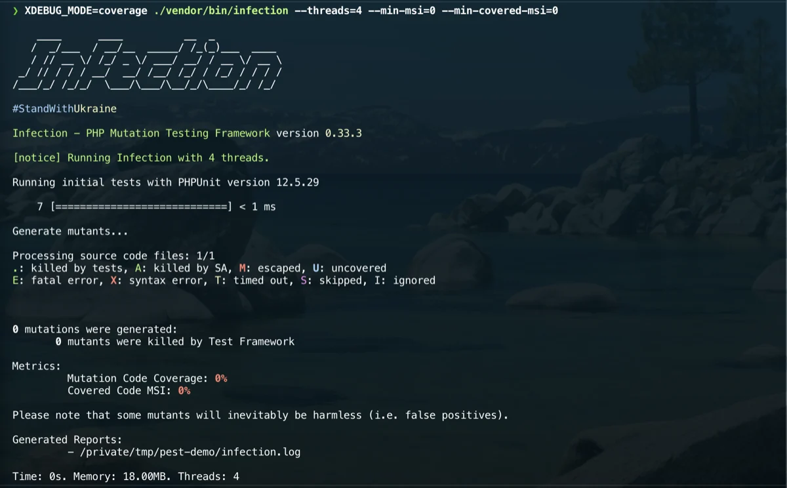

# PHP Mutation Testing

[Infection](https://infection.github.io/guide/) is the mutation testing tool to
consider for mature PHP projects.

Mutation testing intentionally changes code and checks whether the test suite
fails. It is valuable, but slower than normal tests, so keep it manual or in a
dedicated CI job.

## Installation

Install Infection per project:

```bash
composer require --dev infection/infection
```

Initialize configuration:

```bash
vendor/bin/infection --init
```

## Composer script

Add a project script:

```json
{
  "scripts": {
    "mutation": "infection --threads=max"
  }
}
```

Run it manually:

```bash
composer mutation
```



## Scope

Start with focused paths before running mutation testing across an entire legacy
application:

```json
{
  "source": {
    "directories": [
      "src/Domain"
    ]
  }
}
```

## CI boundary

Do not put mutation testing in the default local test command. Prefer:

- a scheduled CI job;
- a manual CI workflow;
- a release-hardening checklist;
- a focused run for critical domains.

## Interpreting results

Use mutation results to improve meaningful assertions. Avoid chasing 100 percent
scores when the cost is brittle or low-value tests.
