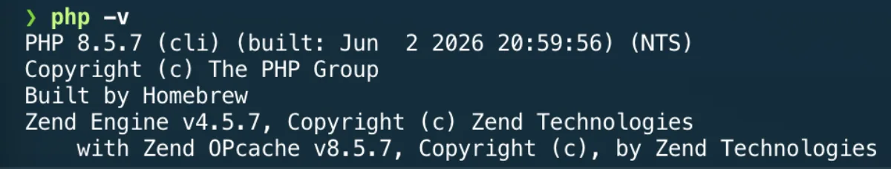
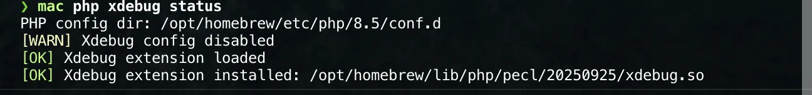

# PHP and Symfony

The full profile installs the PHP runtime used by local Symfony projects:

- `php` for the Homebrew-managed PHP runtime;
- `composer` for PHP dependencies;
- `symfony-cli/tap/symfony-cli` for Symfony local tooling.

Project dependencies, quality tools, and test tools should live in each
project's `composer.json`. This repository installs the shared runtime only.



## Installation

Install the full profile:

```bash
mac setup --profile full
```

Or install the tools directly:

```bash
brew install php composer
brew install symfony-cli/tap/symfony-cli
```

## Validation

Check the runtime:

```bash
php --version
php --ini
composer --version
symfony version
```

The `mac php` helper also checks the local Xdebug state without requiring you to
inspect PHP configuration files manually:



Check that Composer can inspect the local platform:

```bash
composer check-platform-reqs
```

Run the Symfony local server from a project directory:

```bash
symfony serve
```

Stop local Symfony services when finished:

```bash
symfony server:stop
```

## Project Boundary

Keep these decisions inside each PHP project:

- framework version;
- Composer dependencies;
- test runner;
- static analysis level;
- coding standard;
- Rector rules;
- Xdebug and PCOV activation.

Use repository-level Homebrew only for tools that must exist before a project is
cloned or bootstrapped.

## Toolchain Guides

Use the focused guides for project-level decisions:

- [Xdebug](xdebug.md) for debugging and profiling;
- [coverage](coverage.md) for PCOV and coverage reports;
- [static analysis](static-analysis.md) for PHPStan;
- [Pest](pest.md) for tests and Composer test scripts;
- [coding standards](coding-standards.md) for PHP-CS-Fixer and Rector;
- [mutation testing](mutation-testing.md) for Infection;
- [mise](mise.md) for runtime version-manager evaluation.

## Rollback

Remove the shared runtime tools:

```bash
brew uninstall symfony-cli
brew uninstall composer php
```

Project dependencies remain in each project's `vendor/` directory and lock file.
