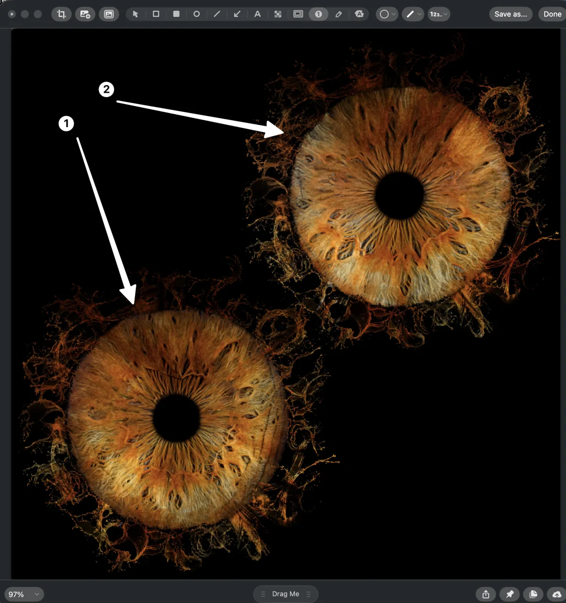

# CleanShot X

[CleanShot X](https://cleanshot.com/) is a screenshot and screen recording tool
for macOS. It replaces the native screenshot workflow with annotations, scrolling
capture, OCR, GIF recording, and a cloud upload option.

It is installed through Homebrew and declared in the project `Brewfile`.
**Licence activation is manual** — the cask installs the app but the licence
key must be entered by hand. It is never stored in this repository.

## Installation

It is part of the curated Homebrew environment; see [`Homebrew setup`](../homebrew/homebrew.md) to install everything at once.

Install CleanShot X directly:

```bash
brew install --cask cleanshot
```

After installation, open CleanShot X, go to `Preferences → License` and enter
your licence key.

Disable the native macOS screenshot shortcut to avoid conflicts:

```text
System Settings → Keyboard → Keyboard Shortcuts → Screenshots → disable all
```

## Core features

### Capture

| Shortcut (default) | Action |
| --- | --- |
| `Cmd+Shift+3` | Capture fullscreen |
| `Cmd+Shift+4` | Capture area |
| `Cmd+Shift+5` | Capture window |
| `Cmd+Shift+6` | Scrolling capture |
| `Cmd+Shift+7` | Record screen (video or GIF) |

### Annotations

After capture, the annotation toolbar opens. Available tools: arrow, text,
rectangle, highlight, blur, numbered steps, and a pixelate tool for redacting
sensitive content.



Use blur and pixelate to redact hostnames, tokens, and personal data before
publishing screenshots in documentation or issues.

### OCR

Select `Text Recognition` from the capture menu to extract text from any area
of the screen. Useful for copying error messages from non-selectable UI.

### Scrolling capture

Captures content that extends beyond the visible screen area. Works with most
native macOS apps and browsers.

### All captures

CleanShot X keeps a history of all captures in `Cmd+Shift+Space`. Recapture,
re-annotate, or copy a previous screenshot at any time.

## Documentation workflow

Capture → annotate → redact sensitive content → export PNG → place in
`assets/screenshots/`.

Redact before exporting:

- Blur or pixelate hostnames, IP addresses, and tokens.
- Remove or replace personal names and email addresses.
- Crop out anything outside the subject of the screenshot.

## Rollback

Remove CleanShot X with Homebrew:

```bash
brew uninstall --cask cleanshot
```

Then remove its entry from `profiles/full/Brewfile`.

Re-enable native macOS screenshot shortcuts from `System Settings → Keyboard →
Keyboard Shortcuts → Screenshots`.

---

[← Docs index](../README.md) · [Project README](../../README.md)
