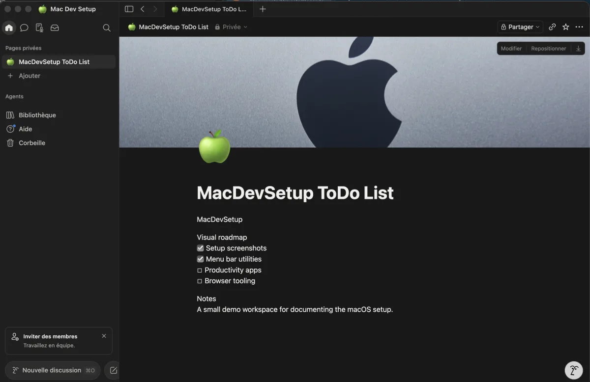

# Notion

[Notion](https://www.notion.so/) is a collaborative workspace combining notes,
databases, wikis, and project tracking. It is used via both the desktop app and
the web interface.

The desktop app is installed through Homebrew and declared in the project
`Brewfile`. Account creation and data live on Notion's servers — nothing is
stored locally beyond the app cache.



## Installation

It is part of the curated Homebrew environment; see [`Homebrew setup`](../homebrew/homebrew.md) to install everything at once.

Install Notion directly:

```bash
brew install --cask notion
```

Sign in with your Notion account after launch. The desktop app and the web
interface share the same workspace — switching between them is seamless.

## Desktop app vs web

| Feature | Desktop app | Web |
| --- | --- | --- |
| Offline access (cached pages) | Yes | No |
| Native notifications | Yes | Browser notifications only |
| Quick capture shortcut | Yes (`Cmd+Shift+N` by default) | No |
| OS integration (menu bar, dock) | Yes | No |

Use the desktop app as the primary entry point. The web interface is useful when
working on a machine where the app is not installed.

## Privacy

Notion is a cloud service. Do not store in Notion:

- Private keys, tokens, or passwords.
- Client data subject to confidentiality agreements.
- Secrets that belong in a password manager or `.env` file.

Use Notion for project notes, documentation drafts, task tracking, and shared
team references — not for sensitive credentials.

## Rollback

Remove the Notion desktop app with Homebrew:

```bash
brew uninstall --cask notion
```

Then remove its entry from `profiles/full/Brewfile`.

Workspace data is not affected by uninstalling the desktop app.
