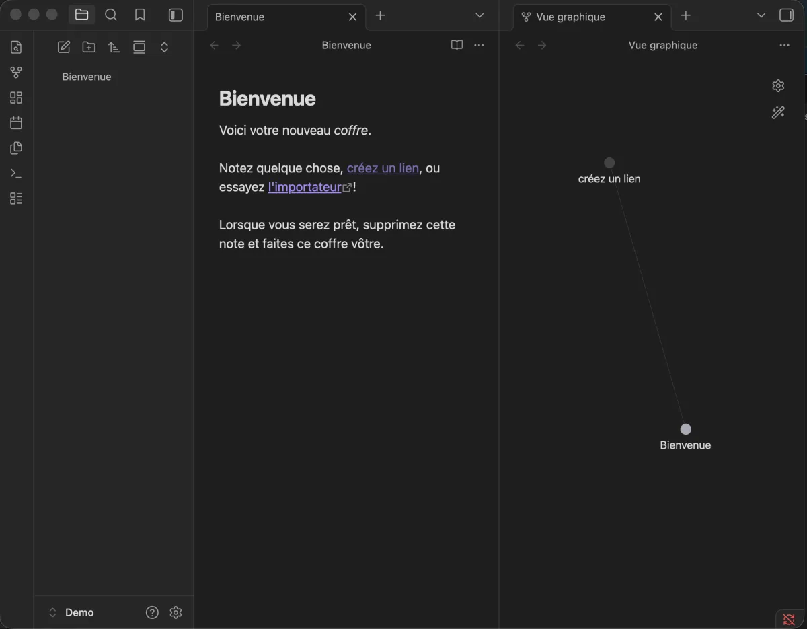

# Obsidian

[Obsidian](https://obsidian.md/) is a local-first Markdown note-taking app. Notes
are stored as plain `.md` files in a vault directory you control. There is no
mandatory cloud account.

It is installed through Homebrew and declared in the project `Brewfile`.

**The personal vault is never committed to this repository.**



## Installation

It is part of the curated Homebrew environment; see [`Homebrew setup`](../homebrew/homebrew.md) to install everything at once.

Install Obsidian directly:

```bash
brew install --cask obsidian
```

On first launch, choose `Open folder as vault` and point it to your notes
directory (for example `~/Documents/Notes`).

## Vault structure

Obsidian imposes no structure. A reasonable starting layout:

```text
~/Documents/Notes/
  .obsidian/          # Obsidian configuration (plugins, hotkeys, appearance)
  Projects/
  Areas/
  Resources/
  Archive/
```

The `.obsidian/` folder contains plugin settings and appearance configuration.
It can be committed to a private repo to sync settings across machines, as long
as it contains no tokens or API keys.

## Essential plugins (community)

Install community plugins from `Settings → Community plugins → Browse`.

| Plugin | Purpose |
| --- | --- |
| Dataview | Query notes as a database using inline metadata |
| Templater | Insert dynamic templates with variables and scripts |
| Calendar | Weekly and daily note navigation |
| Git | Sync the vault to a private Git repository |

Enable community plugins first: `Settings → Community plugins → Turn on community plugins`.

## Sync and backup

Obsidian Sync is the official paid sync service. Alternatives:

- **Private Git repo** — commit and push the vault with the Git plugin. Simple
  and free; works well for text-heavy vaults without large attachments.
- **iCloud / Dropbox** — place the vault in a synced folder. Works transparently
  but adds a cloud dependency.

Whichever method is chosen, the vault stays in a **personal private repository**
or synced folder — never in this setup repository.

## Privacy

Do not store secrets, tokens, passwords, or confidential professional data in
Obsidian unless the vault is fully private and access-controlled. The `.obsidian/`
folder can contain plugin tokens if third-party plugins are used.

## Rollback

Remove Obsidian with Homebrew:

```bash
brew uninstall --cask obsidian
```

Then remove its entry from `profiles/full/Brewfile`.

The vault directory is not affected by uninstalling the app.

---

[← Docs index](../README.md) · [Project README](../../README.md)
