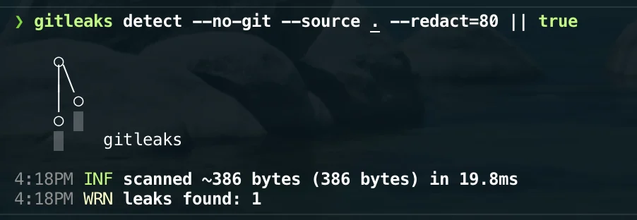

# Gitleaks

Gitleaks detects secrets, credentials, API keys, and other sensitive values accidentally committed to a Git repository.

It is included in this setup as a preventive security tool. Its purpose is to detect exposed secrets before they are pushed to a remote repository.

## Installation

Gitleaks is installed through Homebrew:

```bash
brew install gitleaks
```

It is part of the curated Homebrew environment; see [`Homebrew setup`](../homebrew/homebrew.md) to install everything at once.

## Verify the installation

Check that Gitleaks is available:

```bash
gitleaks version
```

## Scan a repository

From the root of a Git repository, scan the complete Git history with:

```bash
gitleaks git .
```

To scan only the current files without inspecting the Git history:

```bash
gitleaks dir .
```



## Exit status

Gitleaks returns a non-zero exit status when a potential secret is detected.

This makes it suitable for local validation scripts, pre-commit hooks, and continuous integration workflows.

## Pre-commit integration

Gitleaks should eventually be executed automatically through `pre-commit`.

The integration is intentionally handled separately from the Homebrew installation so that:

- Homebrew manages the executable.
- `pre-commit` manages when the scan is executed.
- The repository configuration remains explicit and version-controlled.

Until the pre-commit configuration is added, scans can be executed manually with:

```bash
gitleaks git .
```

## False positives

A detected value is not always a real secret.

Before ignoring a finding:

1. Confirm that the value is not an active credential.
2. Revoke and replace it if it has already been exposed.
3. Add a targeted exclusion only when the value is known to be safe.

Broad exclusions should be avoided because they can hide future leaks.

## Rollback

Remove Gitleaks with:

```bash
brew uninstall gitleaks
```

Then remove its entry from `profiles/full/Brewfile`.

Any related pre-commit hook must also be removed separately.
