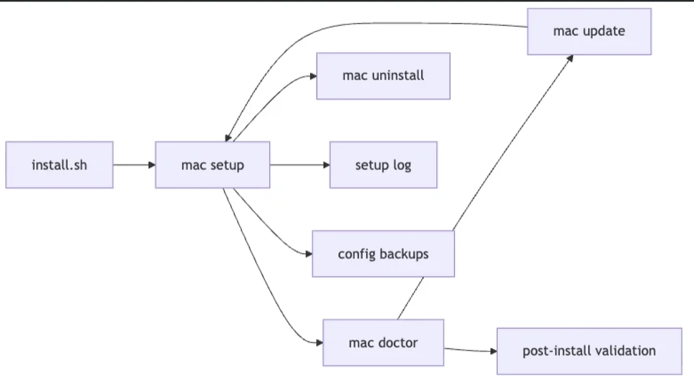
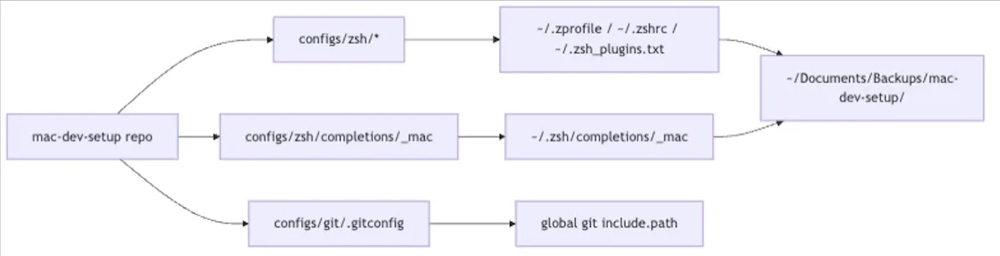
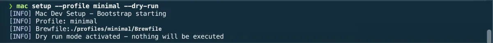
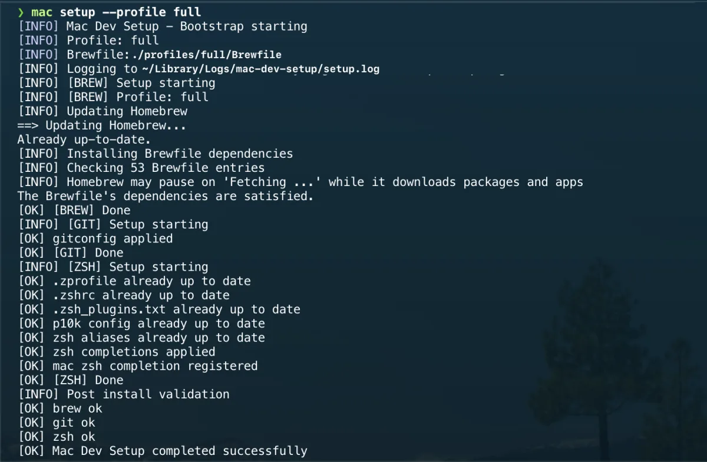

# Setup command

The supported entry point for applying the macOS development environment is:

```bash
mac setup
```

The CLI delegates to `scripts/setup.sh`, which keeps the same options for direct
maintenance use.





## Usage

Display the available CLI commands:

```bash
mac help
```

Install or reapply the default setup:

```bash
mac setup
```

## Profiles

Installation profiles select the Homebrew tools installed during setup.

The default profile is `full`:

```bash
mac setup
mac setup --profile full
```

Use the minimal profile for a smaller command-line setup:

```bash
mac setup --profile minimal
```

Preview the setup without changing the machine:

```bash
mac setup --profile minimal --dry-run
```



Profiles are defined under:

```text
profiles/<name>/Brewfile
```

To add a new profile, create a new directory under `profiles/` and add a
`Brewfile`. Any profile whose name matches the safe charset (`[A-Za-z0-9_-]`)
and ships a `Brewfile` is accepted automatically — there is no allowlist to
edit in `scripts/lib/profiles.sh`.

## Supported steps

### Homebrew

```bash
mac setup --profile full
```

Installs the dependencies declared by the selected profile Brewfile.



### Git

```bash
mac setup
```

Adds the repository Git configuration as a managed global include.

### Zsh

```bash
mac setup
```

Applies the curated Zsh files and installs the generated `mac` completion.

## Optional tools

Some versioned assets are intentionally kept out of the default `mac setup`
flow. Each has its own opt-in `mac` command (which wraps the corresponding
versioned script under `scripts/`).

### Visual Studio Code extensions

Install the recommended extensions listed in:

```text
configs/vscode/extensions.txt
```

with:

```bash
mac vscode
```

Optional extensions remain explicit:

```bash
mac vscode --with-optional
```

### French OSS keyboard layout

```bash
mac keyboard
```

Installs the versioned French OSS keyboard layout bundle (for French typists).

An existing installation is backed up before replacement.

A logout and login are still required before macOS reloads the layout.

### macOS defaults

```bash
mac defaults
```

Applies the curated Finder, Dock, screenshot, keyboard, and text-substitution preferences.

### Warp

The versioned Warp configuration is stored at:

```text
configs/warp/settings.toml
```

Install it manually after reviewing the file:

```bash
mkdir -p "$HOME/.warp"
cp configs/warp/settings.toml "$HOME/.warp/settings.toml"
```

Warp should be restarted after applying the configuration.

## SSH exclusion

SSH is intentionally excluded from the global setup script.

Automatically replacing `~/.ssh/config` could overwrite personal hosts, identities, proxy settings, or server-specific configuration.

The SSH example must therefore be reviewed and installed manually.

## Validation

Validate the script with ShellCheck:

```bash
shellcheck scripts/setup.sh
```

Display its help output:

```bash
./scripts/setup.sh --help
```

Test the dry-run path:

```bash
./scripts/setup.sh --profile minimal --dry-run
```

## Environment variables

Advanced users can override the defaults below. They are read by `install.sh`
and the `mac` commands; most users never need them.

| Variable | Used by | Default | Purpose |
| --- | --- | --- | --- |
| `MAC_DEV_SETUP_REPO_URL` | `install.sh` | the official repo | Clone from your own fork instead. |
| `MAC_DEV_SETUP_INSTALL_DIR` | install / uninstall | `~/.mac-dev-setup` | Where the checkout lives. |
| `MAC_DEV_SETUP_BIN_DIR` | install / uninstall | `~/.local/bin` | Directory holding the `mac` symlink. |
| `MAC_DEV_SETUP_CLI_NAME` | install / uninstall | `mac` | Name of the installed command. |
| `MAC_DEV_SETUP_SHELL_CONFIG` | PATH manager | shell-specific | Profile file the managed PATH block is written to. |
| `MAC_DEV_SETUP_LOG_DIR` | `mac setup` | `~/Library/Logs/mac-dev-setup` | Where the setup log is written. |
| `MAC_DEV_SETUP_UPDATE_REMOTE` | `mac update` | `origin` | Git remote to update from. |
| `MAC_DEV_SETUP_UPDATE_BRANCH` | `mac update` | `main` | Fallback branch when no upstream is set. |
| `MAC_DEV_SETUP_PHP_CONF_DIR` | `mac php` | Homebrew PHP `conf.d` | Override the PHP config directory. |
| `MAC_DEV_SETUP_PHP_BACKUP_DIR` | `mac php` | `~/Documents/Backups/mac-dev-setup/php` | Where an existing `99-xdebug.ini` is backed up. |

## Rollback

The global script does not provide one universal rollback command.

Each setup area keeps its own rollback procedure in the relevant documentation:

- Homebrew;
- Visual Studio Code;
- Warp;
- macOS defaults;
- French OSS keyboard layout.

Review the corresponding documentation before restoring or removing a configuration.

---

[← Docs index](../README.md) · [Project README](../../README.md)
