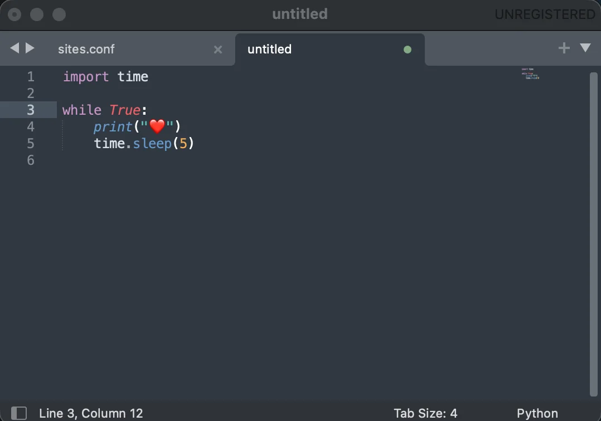

# Sublime Text

[Sublime Text](https://www.sublimetext.com/) is a fast and lightweight text
editor. It is used alongside VS Code for quick file edits, large file handling,
and situations where a minimal editor without project context is preferable.

It is installed through Homebrew and declared in the project `Brewfile`.

## Installation

It is part of the curated Homebrew environment; see [`Homebrew setup`](../homebrew/homebrew.md) to install everything at once.

Install Sublime Text directly:

```bash
brew install --cask sublime-text
```

Verify the installation:

```bash
brew list --cask | grep sublime-text
```

The `subl` command-line launcher is available after installation:

```bash
subl filename.txt
subl .
```



## When to use Sublime Text vs VS Code

| Situation | Editor |
| --- | --- |
| Full project development (PHP, Symfony) | VS Code |
| Quick edit of a single file | Sublime Text |
| Opening a large file (logs, SQL dumps) | Sublime Text |
| Editing without loading a workspace | Sublime Text |

Sublime Text starts faster than VS Code and handles large files without
performance issues. It is not configured with project-specific extensions and
intentionally kept minimal.

## Key features

- **Multiple cursors** — `Cmd+Click` or `Cmd+D` to select the next occurrence.
- **Command palette** — `Cmd+Shift+P` to run any command.
- **Goto anything** — `Cmd+P` to open any file by name.
- **Split editing** — `View → Layout` to edit two files side by side.

## Licence

Sublime Text is commercial software. It can be evaluated for free without a
time limit, but a licence is required for continued use. The licence is
activated manually and is never stored in this repository.

## Rollback

Remove Sublime Text with Homebrew:

```bash
brew uninstall --cask sublime-text
```

Then remove its entry from `profiles/full/Brewfile`.
