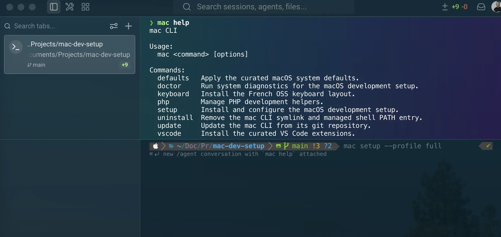

# Warp

[Warp](https://www.warp.dev/) is a modern terminal with built-in AI assistance and shareable workflows.

The tool is installed through Homebrew and declared in the project `Brewfile`.



## Installation

It is part of the curated Homebrew environment; see [`Homebrew setup`](../homebrew/homebrew.md) to install everything at once.

Install Warp:

```bash
brew install --cask warp
```

Verify the installation:

```bash
brew list --cask | grep -x warp

test -d "/Applications/Warp.app" \
  && echo "Warp application found."
```

## Configuration

The shared Warp configuration is stored in:

```text
configs/warp/settings.toml
```

It contains the selected appearance, terminal, privacy, notification, session, and text-editing preferences.

Personal paths, account-specific data, cloud conversation storage, and the legacy SSH wrapper are intentionally excluded.

## Font

Warp uses MesloLGS NF to stay compatible with Powerlevel10k glyphs:

```toml
[appearance.text]
font_name = "MesloLGS NF"
font_size = 12.0
line_height = 1.1
```

## Privacy

Telemetry and crash reporting are disabled:

```toml
[privacy]
telemetry_enabled = false
crash_reporting_enabled = false
```

Secret redaction remains enabled and includes additional patterns for common API keys, tokens, addresses, and credentials.

## Shell integration

Warp respects the shell prompt configured by Zsh and Powerlevel10k:

```toml
[terminal.input]
honor_ps1 = true
```

Automatic AI command detection and natural-language input in the terminal are disabled.

## Working directories

New tabs, windows, and split panes reuse the previous working directory.

The initial terminal opens in the user's home directory.

## Installation of the configuration

Back up the current configuration first:

```bash
mkdir -p "$HOME/Documents/Backups/warp"

cp "$HOME/.warp/settings.toml" \
  "$HOME/Documents/Backups/warp/settings.toml.backup"
```

Copy the versioned configuration:

```bash
mkdir -p "$HOME/.warp"

cp configs/warp/settings.toml \
  "$HOME/.warp/settings.toml"
```

Restart Warp after applying the file.

## Validation

Validate the TOML syntax:

```bash
python3 - <<'PY'
from pathlib import Path
import tomllib

with Path("configs/warp/settings.toml").open("rb") as file:
    tomllib.load(file)

print("Warp TOML configuration is valid.")
PY
```

Confirm that rejected and project-specific settings are absent:

```bash
grep -nE 'Novera|cloud_conversation|legacy_ssh' \
  configs/warp/settings.toml \
  || echo "No rejected or project-specific Warp settings found."
```

## Rollback

Restore the previous configuration:

```bash
cp "$HOME/Documents/Backups/warp/settings.toml.backup" \
  "$HOME/.warp/settings.toml"
```

Uninstall Warp managed through Homebrew:

```bash
brew uninstall --cask warp
```

The local configuration under `~/.warp` is stored separately from the application and may remain after uninstalling Warp.
