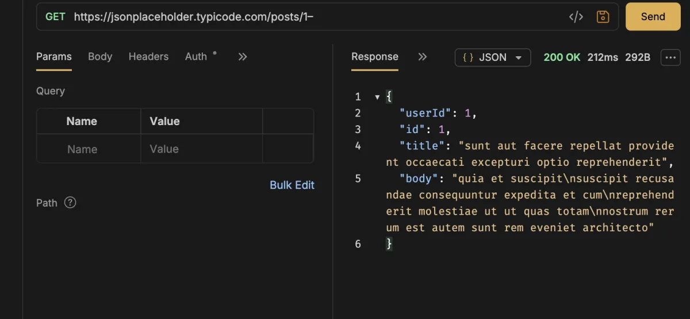

# Bruno

[Bruno](https://www.usebruno.com/) is an open-source API client. Unlike cloud-based
alternatives, Bruno stores collections as plain text files on disk, which means
they can be committed alongside the project they describe.

It is installed through Homebrew and declared in the project `Brewfile`.

## Installation

It is part of the curated Homebrew environment; see [`Homebrew setup`](../homebrew/homebrew.md) to install everything at once.

Install Bruno directly:

```bash
brew install --cask bruno
```

Verify the installation:

```bash
brew list --cask | grep -x bruno
```



## Collections

A Bruno collection is a directory. Each request is a `.bru` file. Create a
collection from the UI or by initialising a directory:

```text
my-api/
  bruno.json        # collection metadata
  get-users.bru
  create-user.bru
  environments/
    local.bru
    staging.bru
```

This structure commits naturally alongside a Symfony project:

```text
my-project/
  src/
  tests/
  api-collection/   # Bruno collection
```

## Environments and secrets

Define variables in environment files. Never hardcode tokens or passwords in
`.bru` files.

```text
vars {
  base_url: http://localhost:8000
  token:
}
```

Keep a `.env` file at the collection root for secret values and add it to
`.gitignore`:

```bash
echo ".env" >> my-api/.gitignore
```

Reference the variable in a request:

```text
headers {
  Authorization: Bearer {{token}}
}
```

## OrbStack and Docker

When the API runs inside an OrbStack container, use the container's hostname
instead of `localhost`:

```text
vars {
  base_url: http://my-app.orb.local
}
```

## Importing an existing collection

Bruno can import from OpenAPI/Swagger, Postman, and Insomnia. Use
`File → Import Collection` from the menu.

## Rollback

Remove Bruno with Homebrew:

```bash
brew uninstall --cask bruno
```

Then remove its entry from `profiles/full/Brewfile`.

Collections stored in project repositories are not affected by uninstalling Bruno.

---

[← Docs index](../README.md) · [Project README](../../README.md)
