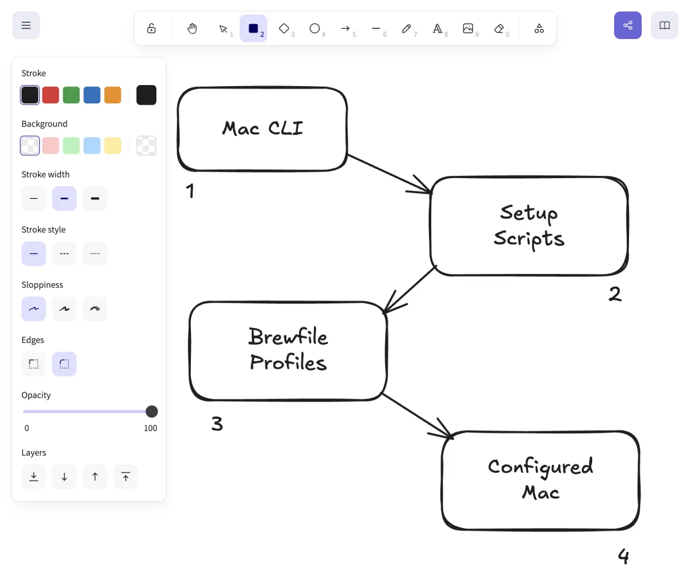

# Excalidraw

[Excalidraw](https://excalidraw.com/) is a virtual whiteboard for sketching
hand-drawn-style diagrams. It is used in this project for architecture diagrams,
flow charts, and visual documentation.

No installation required. The primary workflow uses the web app. A VS Code
extension is available for editing diagrams directly alongside the code.



## Web app

Open [excalidraw.com](https://excalidraw.com/) directly in the browser.

Files are saved as `.excalidraw` (JSON) and can be committed to the repository.
Use `File → Save to disk` to export, or drag an existing `.excalidraw` file into
the browser to reopen it.

## VS Code extension

The [Excalidraw extension](https://marketplace.visualstudio.com/items?itemName=pomdtr.excalidraw-editor)
by pomdtr lets you open and edit `.excalidraw` files directly in VS Code without
leaving the editor.

Install from the VS Code marketplace or from the command palette:

```text
Extensions: Install Extensions → search "Excalidraw"
```

With this extension, `.excalidraw` files open as a live canvas inside VS Code.
Changes are saved directly to disk.

## File format

Excalidraw files are plain JSON. They are safe to commit to a repository:

```text
assets/diagrams/
  install-flow.excalidraw
  cli-architecture.excalidraw
  doctor-drift-flow.excalidraw
```

Export a static image for embedding in documentation:

```text
File → Export image → PNG or SVG
```

Save the exported image in `assets/diagrams/` alongside the source file.

## Usage in this project

Diagrams for this repository live in `assets/diagrams/`. The source
`.excalidraw` file is committed so diagrams can be updated later. The exported
PNG or SVG is what appears in documentation.

## Offline use

Excalidraw can run fully offline. Open the web app once while connected, then
use it without internet access. Nothing is stored on Excalidraw servers unless
you use the collaboration link feature.

---

[← Docs index](../README.md) · [Project README](../../README.md)
