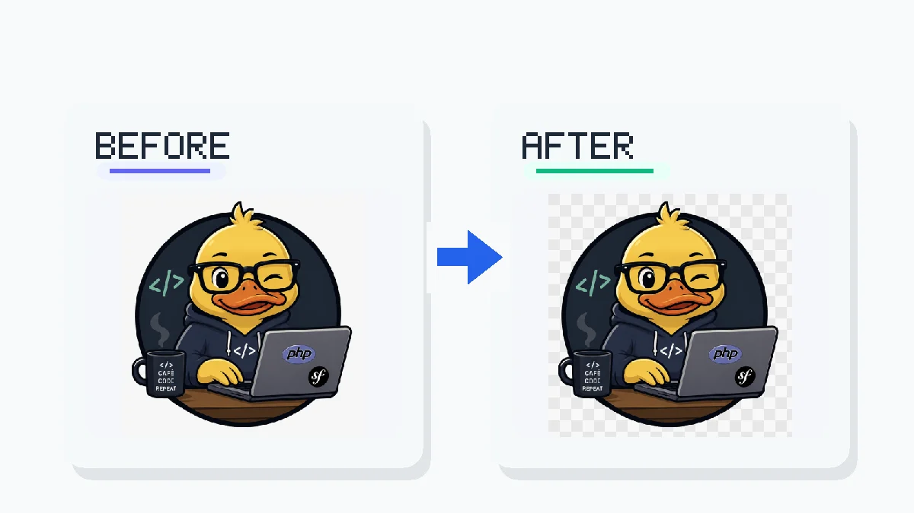

# Image services

This page documents web services useful for image manipulation during web
development. No installation is required.

## remove.bg

[remove.bg](https://www.remove.bg/) is a web service that automatically removes
the background from an image. It also exposes a REST API.

### Usage

Upload an image on the website or call the API.



Set the `REMOVE_BG_API_KEY` environment variable first, then call the API:

```bash
curl -s -X POST https://api.remove.bg/v1.0/removebg \
  -F "image_file=@photo.jpg" \
  -F "size=auto" \
  -H "X-Api-Key: ${REMOVE_BG_API_KEY}" \
  -o no-bg.png
```

### Limits and privacy

- The free tier processes a limited number of images per month at reduced
  resolution.
- Images are transmitted to and processed on remove.bg servers. Do not upload
  images that contain personal data or confidential content.
- For sensitive images, use GIMP locally instead.

---

[← Docs index](../README.md) · [Project README](../../README.md)
