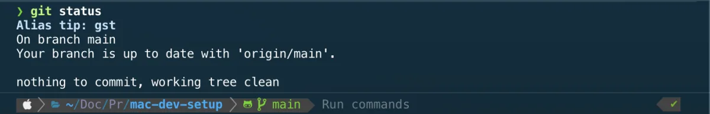

# Powerlevel10k

Powerlevel10k is the prompt theme used by the curated Zsh configuration.



The repository stores the accepted configuration in:

```text
configs/zsh/.p10k.zsh
```

## Installation

Powerlevel10k is loaded through Antidote as part of the documented Zsh setup.

Follow the main Zsh installation instructions first:

```text
docs/zsh/zsh.md
```

The repository configuration must then be copied to the home directory:

```bash
cp configs/zsh/.p10k.zsh "$HOME/.p10k.zsh"
```

The interactive Zsh configuration must load this file:

```zsh
[[ -f "$HOME/.p10k.zsh" ]] && source "$HOME/.p10k.zsh"
```

## Configuration

The committed file represents the manually reviewed prompt configuration used by this setup.

It controls elements such as:

- prompt layout;
- directory display;
- Git status;
- command execution status;
- prompt icons and separators;
- transient prompt behavior.

Personal or machine-specific experiments should be tested locally before replacing the committed configuration.

## Verify the setup

Start a new interactive Zsh session:

```bash
zsh -i
```

Verify that the Powerlevel10k variables are loaded:

```bash
zsh -ic 'typeset -p POWERLEVEL9K_MODE'
```

The prompt should appear without startup errors.

A final cold-start test should be performed by closing the terminal application completely, reopening it, and confirming that the prompt loads correctly.

## Reconfigure

Powerlevel10k provides an interactive configuration wizard:

```bash
p10k configure
```

The wizard writes a new configuration to:

```text
~/.p10k.zsh
```

Review and test the generated file before copying it into the repository.

## Troubleshooting

If the prompt does not load, verify that the configuration file exists:

```bash
test -f "$HOME/.p10k.zsh" \
  && echo "Powerlevel10k configuration found."
```

Verify that Powerlevel10k is present in the Antidote plugin list and that Antidote loads successfully.

Run an interactive Zsh configuration test:

```bash
zsh -ic 'echo "Zsh configuration loaded successfully"'
```

If icons are missing or malformed, confirm that the terminal uses a compatible Nerd Font.

## Rollback

Back up the current local configuration before replacing it:

```bash
cp "$HOME/.p10k.zsh" "$HOME/.p10k.zsh.backup"
```

Restore the previous configuration with:

```bash
cp "$HOME/.p10k.zsh.backup" "$HOME/.p10k.zsh"
```

To stop loading the configuration entirely, remove or comment out the following line from `~/.zshrc`:

```zsh
[[ -f "$HOME/.p10k.zsh" ]] && source "$HOME/.p10k.zsh"
```

The committed repository configuration can be restored at any time with:

```bash
cp configs/zsh/.p10k.zsh "$HOME/.p10k.zsh"
```
