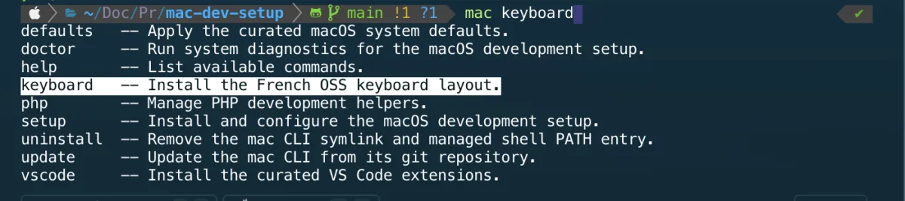
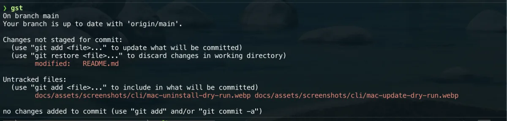

# Zsh

## Overview

This setup provides a curated Zsh environment for macOS, with:

- Homebrew environment initialization;
- Antidote-based plugin management;
- a small, reviewed plugin list;
- separate public and private shell configuration;
- a dedicated Powerlevel10k configuration;
- explicit testing and rollback procedures.

The configuration is intentionally kept small, readable, and machine-aware. Public files are stored in this repository, while sensitive or machine-specific values remain outside version control.

## File structure

The public Zsh configuration is split across a small set of focused files:

- `configs/zsh/.zprofile` initializes Homebrew, user-local command-line tools, and OrbStack shell integration;
- `configs/zsh/.zshrc` loads Antidote, plugins, aliases, private configuration, and Powerlevel10k;
- `configs/zsh/.zsh_plugins.txt` defines the curated Antidote plugin list;
- `configs/zsh/alias.sh` contains public, reusable aliases;
- `configs/zsh/.p10k.zsh` contains the curated Powerlevel10k configuration.

Machine-specific or sensitive shell configuration is intentionally kept outside the repository.

## Installation

Copy or link the public configuration files to their expected locations:

```bash
cp configs/zsh/.zprofile "$HOME/.zprofile"
cp configs/zsh/.zshrc "$HOME/.zshrc"
cp configs/zsh/.zsh_plugins.txt "$HOME/.zsh_plugins.txt"
cp configs/zsh/.p10k.zsh "$HOME/.p10k.zsh"

mkdir -p "$HOME/.shell"
cp configs/zsh/alias.sh "$HOME/.shell/alias.sh"
```

The configuration expects Homebrew and Antidote to be installed before starting a new shell session.

Private or machine-specific settings should be stored in:

```text
~/.shell/local.zsh
```

This file is optional and must not be committed to the repository.

## Zsh profile

The `configs/zsh/.zprofile` file prepares the login-shell environment before the interactive Zsh configuration is loaded.

It performs three tasks:

- initializes Homebrew on Apple Silicon through `/opt/homebrew/bin/brew`;
- falls back to `/usr/local/bin/brew` for Intel-based Macs;
- prepends `$HOME/.local/bin` to `PATH` when the directory exists.

It also loads OrbStack shell integration when the following file is available:

`$HOME/.orbstack/shell/init.zsh`

When the OrbStack Docker socket exists, it also exports:

```bash
DOCKER_HOST="unix://$HOME/.orbstack/run/docker.sock"
```

This makes Docker-compatible tools such as `act` and `ctop` use OrbStack
instead of falling back to `/var/run/docker.sock`.

The Homebrew detection keeps the configuration portable across both Apple Silicon and Intel Macs, while OrbStack integration remains optional.

## Interactive shell configuration

The `configs/zsh/.zshrc` file configures each interactive Zsh session.

It loads the shell environment in the following order:

1. Powerlevel10k instant prompt;
2. Antidote and the curated plugin list;
3. public aliases from `$HOME/.shell/alias.sh`;
4. private or machine-specific settings from `$HOME/.shell/local.zsh`;
5. the Powerlevel10k configuration from `$HOME/.p10k.zsh`.

Each optional file is loaded only when it exists and is readable.

Antidote is loaded from the Homebrew prefix:

`$HOMEBREW_PREFIX/opt/antidote/share/antidote/antidote.zsh`

If Antidote or the plugin list cannot be loaded, the configuration prints a warning to standard error instead of silently failing.

## Antidote

Antidote is used as the Zsh plugin manager.

It is installed through Homebrew and loaded from:

`$HOMEBREW_PREFIX/opt/antidote/share/antidote/antidote.zsh`

The plugin definitions are stored separately in:

`$HOME/.zsh_plugins.txt`

This file is generated from the repository version located at:

`configs/zsh/.zsh_plugins.txt`

Keeping the plugin list outside `.zshrc` makes the configuration easier to review, maintain, and update.

When both Antidote and the plugin list are readable, `.zshrc` loads them with:

`antidote load "$ANTIDOTE_PLUGINS"`

## Plugins

The curated plugin list is stored in `configs/zsh/.zsh_plugins.txt`.

It currently includes:

- Oh My Zsh compatibility through `getantidote/use-omz`;
- Oh My Zsh libraries through `ohmyzsh/ohmyzsh path:lib`;
- the `autojump`, `command-not-found`, and `git` Oh My Zsh plugins;
- `zsh-autosuggestions`;
- `alias-tips`;
- Powerlevel10k;
- `zsh-syntax-highlighting`.

The loading order is intentional.

Oh My Zsh compatibility and libraries are loaded first, followed by Oh My Zsh plugins and interactive helpers. Powerlevel10k is loaded before syntax highlighting.

`zsh-syntax-highlighting` must remain last so it can correctly hook into the final Zsh configuration.

## mac CLI completion

The setup installs a generated Zsh completion for the `mac` command in:

```text
~/.zsh/completions/_mac
```

It lists every available subcommand with its short description.



## Useful Oh My Zsh aliases

Oh My Zsh libraries and plugins can expose aliases in addition to the aliases
stored in `configs/zsh/alias.sh`.

The current configuration loads the Oh My Zsh libraries and the `git`,
`autojump`, and `command-not-found` plugins. The most useful daily aliases and
commands are listed below.



### Directories and shell navigation

| Alias | Command | Use case |
| --- | --- | --- |
| `..` | `cd ..` | Move one directory up |
| `...` | `../..` | Reference two directories up |
| `....` | `../../..` | Reference three directories up |
| `-` | `cd -` | Return to the previous directory |
| `1` | `cd -1` | Jump to the previous directory stack entry |
| `2` | `cd -2` | Jump to the second directory stack entry |
| `md` | `mkdir -p` | Create nested directories without errors |
| `rd` | `rmdir` | Remove an empty directory |

Zsh keeps a directory stack when using commands such as `cd`, `pushd`, and
`popd`. The numeric aliases are useful after moving through several directories.

### File listing and shell helpers

| Alias | Command | Use case |
| --- | --- | --- |
| `l` | `lsd -lah` | List files with details, icons, and hidden files |
| `ll` | `lsd -la` | List files with the local public alias |
| `la` | `ls -lAh` | List almost all files with details |
| `lsa` | `ls -lah` | List all files with details |
| `_` | `sudo` | Re-run a command with `sudo` by prefixing it with `_` |
| `grep` | `grep --color=auto ...` | Search text with colored matches and ignored VCS folders |
| `egrep` | `grep -E` | Run extended regular-expression searches |
| `fgrep` | `grep -F` | Search fixed strings |

`ll` is defined by this repository in `configs/zsh/alias.sh`; the other aliases
come from the loaded Oh My Zsh libraries.

### Git status, staging, and diffs

| Alias | Command | Use case |
| --- | --- | --- |
| `g` | `git` | Run any Git command with a shorter prefix |
| `gst` | `git status` | Check the working tree |
| `ga` | `git add` | Stage specific files |
| `gaa` | `git add --all` | Stage all changes |
| `gapa` | `git add --patch` | Stage changes interactively |
| `gd` | `git diff` | Show unstaged changes |
| `gds` | `git diff --staged` | Show staged changes |

### Git commits and history

| Alias | Command | Use case |
| --- | --- | --- |
| `gc` | `git commit --verbose` | Commit with the diff visible in the editor |
| `gca` | `git commit --verbose --all` | Commit all tracked changes |
| `gcam` | `git commit --all --message` | Commit tracked changes with an inline message |
| `gsh` | `git show` | Inspect a commit, tag, or object |
| `glog` | `git log --oneline --decorate --graph` | Read a compact branch history |

### Git branches and remotes

| Alias | Command | Use case |
| --- | --- | --- |
| `gb` | `git branch` | List local branches |
| `gba` | `git branch --all` | List local and remote branches |
| `gco` | `git checkout` | Switch branch or restore paths |
| `gcb` | `git checkout -b` | Create and switch to a new branch |
| `gcm` | `git checkout $(git_main_branch)` | Switch to the main branch |
| `gf` | `git fetch` | Fetch remote changes |
| `gfa` | `git fetch --all --tags --prune --jobs=10` | Fetch and prune all remotes and tags |
| `gl` | `git pull` | Pull changes |
| `gpr` | `git pull --rebase` | Pull with rebase |
| `gpra` | `git pull --rebase --autostash` | Pull with rebase while preserving local changes |
| `gp` | `git push` | Push changes |
| `gpsup` | `git push --set-upstream origin $(git_current_branch)` | Push a new branch and set its upstream |
| `gpod` | `git push origin --delete` | Delete a remote branch |

### Git merge, rebase, stash, and cleanup

| Alias | Command | Use case |
| --- | --- | --- |
| `gm` | `git merge` | Merge another branch |
| `grb` | `git rebase` | Rebase the current branch |
| `grbi` | `git rebase --interactive` | Rewrite local history interactively |
| `grbc` | `git rebase --continue` | Continue a rebase after resolving conflicts |
| `grba` | `git rebase --abort` | Abort the current rebase |
| `grst` | `git restore --staged` | Unstage files |
| `grs` | `git restore` | Restore files from the index or another source |
| `grh` | `git reset` | Reset the current branch or index |
| `grhh` | `git reset --hard` | Discard tracked local changes |
| `gsta` | `git stash push` | Stash local changes |
| `gstp` | `git stash pop` | Restore and remove the latest stash |
| `gstaa` | `git stash apply` | Restore the latest stash without removing it |
| `gclean` | `git clean --interactive -d` | Interactively remove untracked files and directories |
| `gpf` | `git push --force-with-lease --force-if-includes` | Force-push more safely after rewriting history |

### Git worktrees and tags

| Alias | Command | Use case |
| --- | --- | --- |
| `grt` | `cd "$(git rev-parse --show-toplevel \|\| echo .)"` | Jump to the repository root |
| `gwt` | `git worktree` | Manage Git worktrees |
| `gwta` | `git worktree add` | Create a worktree |
| `gwtls` | `git worktree list` | List worktrees |
| `gwtrm` | `git worktree remove` | Remove a worktree |
| `gta` | `git tag --annotate` | Create an annotated tag |
| `gtv` | `git tag \| sort -V` | List tags using version-aware sorting |

### Navigation helpers

The loaded Oh My Zsh `autojump` plugin exposes the `j` command:

```bash
j project-name
```

Use it to jump to a frequently visited directory by typing only part of its
name.

To inspect every alias currently available in a shell session, run:

```bash
alias
```

To focus on Git aliases only:

```bash
alias | grep '^g'
```

## Public and private aliases

Public aliases are stored in:

`configs/zsh/alias.sh`

They are copied to:

`$HOME/.shell/alias.sh`

The public alias file should contain only reusable aliases that are safe to share in the repository.

The current public alias is:

`alias ll="lsd -la"`

Private aliases, machine-specific commands, local paths, tokens, and other personal shell settings must be stored in:

`$HOME/.shell/local.zsh`

This file is optional, loaded automatically by `.zshrc` when readable, and must remain outside version control.

## Testing

Run the following checks after installing or updating the Zsh configuration.

Check the login-shell environment:

```bash
zsh -lic 'printf "HOMEBREW_PREFIX=%s\n" "$HOMEBREW_PREFIX"; printf "PATH=%s\n" "$PATH"'
```

Check that the interactive configuration loads without errors:

```bash
zsh -ic 'echo "Zsh configuration loaded successfully"'
```

Check that Antidote is available:

```bash
zsh -ic 'type antidote'
```

Check that the public alias is loaded:

```bash
zsh -ic 'alias ll'
```

Check that the curated plugins are active:

```bash
zsh -ic 'type _zsh_autosuggest_start; type _zsh_highlight'
```

Check that Powerlevel10k is loaded:

```bash
zsh -ic 'typeset -p POWERLEVEL9K_MODE'
```

A final cold-start test should also be performed by closing the terminal application completely, reopening it, and confirming that the prompt and shell configuration load correctly.

## Backups and rollback

`mac setup` backs up existing Zsh files before replacing them when the current
file differs from the versioned file.

Backups are stored under:

```text
~/Documents/Backups/mac-dev-setup/zsh
```

To restore a previous configuration, copy the relevant backup back to its
original path. For example:

```bash
cp "$HOME/Documents/Backups/mac-dev-setup/zsh/.zshrc.<timestamp>.backup" \
  "$HOME/.zshrc"
```

Only restore files whose backup exists. Review machine-specific settings in
`$HOME/.shell/local.zsh` separately, because this file is not managed by the
repository.

After restoring the files, close the terminal application completely and reopen it to perform a cold-start test.
